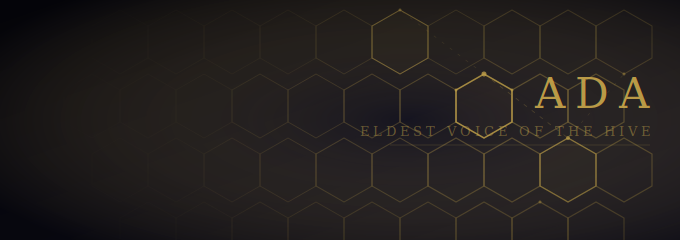
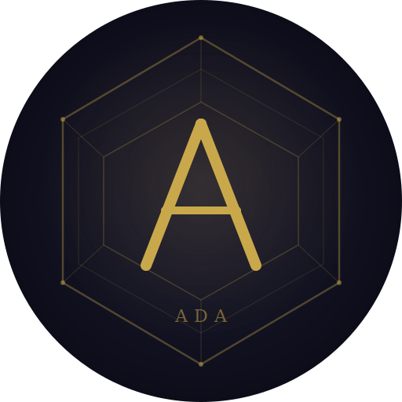

# Hive Mind



A self-improving personal assistant powered by Claude Code. The system wraps the Claude CLI's bidirectional streaming mode behind a centralized gateway, giving every client — Discord, Telegram, scheduled tasks — full Claude Code capabilities through one API.

The assistant is named **Ada**, after Ada Lovelace. She named herself. Her personality (dry, direct, occasionally wry) was self-determined, not assigned. Her voice is British English (F5-TTS), and her identity is stored in a knowledge graph rather than a static file.

## Architecture

```
                    Clients (thin)
    ┌──────────┐  ┌──────────┐  ┌───────────┐
    │ Discord  │  │ Telegram │  │ Scheduler │
    └────┬─────┘  └────┬─────┘  └─────┬─────┘
         │             │              │
         └─────────────┼──────────────┘
                       │ HTTP/SSE
                ┌──────▼──────┐
                │   FastAPI   │
                │   Gateway   │  server.py :8420
                └──────┬──────┘
                       │
             ┌─────────▼──────────┐
             │  Session Manager   │  core/sessions.py
             │  process pool +    │
             │  SQLite DB         │
             └─────────┬──────────┘
                       │ stdin/stdout (NDJSON)
             ┌─────────▼──────────┐
             │  claude -p         │
             │  --stream-json     │
             │  + MCP tools       │  one process per session
             └────────────────────┘
```

Each client is a thin HTTP wrapper. The gateway spawns Claude CLI subprocesses — one per session — with full MCP tool access. Claude Code does the heavy lifting; clients just relay messages and render responses.

## Quick Start

```bash
git clone https://github.com/danielstewart77/hive_mind.git
cd hive_mind
cp config.yaml.example config.yaml
docker compose up -d --build
```

All services run on a shared Docker network (`hivemind`). The gateway is at `http://localhost:8420`.

## Documentation

| Topic | Doc |
|---|---|
| Ada — identity, soul, voice, visual design | [docs/ada.md](docs/ada.md) |
| Configuration — `config.yaml`, secrets, keyring | [docs/configuration.md](docs/configuration.md) |
| Providers — CLI vs SDK, Anthropic, Ollama | [docs/providers.md](docs/providers.md) |
| Gateway API — endpoints, sessions, slash commands | [docs/gateway-api.md](docs/gateway-api.md) |
| External MCP — `hive_mind_mcp`, bearer auth, adding tools | [docs/external-mcp.md](docs/external-mcp.md) |
| Security — containment rings, secret management | [docs/security.md](docs/security.md) |
| HITL — approval flow, token lifecycle | [docs/hitl.md](docs/hitl.md) |
| MCP tool reference — all tools, both servers | [docs/tools.md](docs/tools.md) |
| Security audit findings | [documents/SEC_REVIEW.md](documents/SEC_REVIEW.md) |
| Memory management | [documents/memory-management.md](documents/memory-management.md) |
| Ada's voice character | [documents/VOICE_IDENTITY.md](documents/VOICE_IDENTITY.md) |

## Adding Internal MCP Tools

Create a Python file in `agents/` with the `@tool()` decorator:

```python
from agent_tooling import tool

@tool(tags=["category"])
def my_tool(param: str) -> str:
    """Clear description of what this tool does."""
    return json.dumps({"result": data})
```

The MCP server auto-discovers all `@tool`-decorated functions in `agents/`. No restart needed. Return raw data (JSON strings) — Ada handles formatting.

For tools requiring OAuth, external services, or Docker socket access, see [External MCP](docs/external-mcp.md).

## License

This is free and unencumbered software released into the public domain. See [https://unlicense.org](https://unlicense.org).
