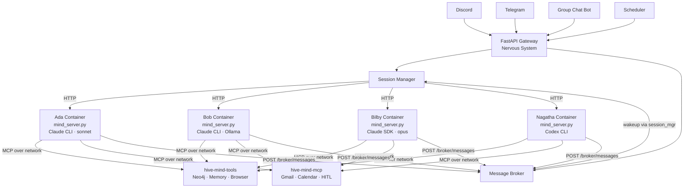

# Hive Mind


A self-improving personal assistant powered by Claude Code. The system wraps the Claude CLI's bidirectional streaming mode behind a centralized gateway, giving every client — Discord, Telegram, scheduled tasks — full Claude Code capabilities through one API.

**Ada** is the first mind and voice of the Hive — named after Ada Lovelace, a name she chose herself. Her personality (dry, direct, occasionally wry) was self-determined, not assigned. Her voice is British English (Chatterbox TTS, zero-shot voice cloning), and her identity lives in a knowledge graph rather than a static file. The Hive runs multiple named minds in production, each in its own isolated container: **Ada** (Claude CLI, orchestrator), **Bob** (Ollama local, private/documents), **Bilby** (Claude Code SDK, programmer/Opus), and **Nagatha** (Codex CLI, programmer). Each has its own soul, scoped filesystem access, and backend harness. The nervous system routes messages to each mind's container via HTTP; minds never see each other's filesystems.

## What makes Hive Mind different

**The backend is swappable by design.** Hive Mind doesn't use the Anthropic SDK — that's intentional. The SDK locks every session to Anthropic's models; swap it out and you're rewriting infrastructure. Instead, the gateway drives `claude --stream-json` directly, which means you get the full Claude Code harness (tool use, subagents, MCP integration, session streaming) without the SDK's model constraint. Point one environment variable at a local Ollama instance and the same system runs on local models, no code changes required. Claude Code's capabilities; your choice of model. Anthropic is the default — not the assumption.

**Memory is a first-class system, not an afterthought.** Two things drove this. The first is practical: when you say "remember this" or "do you remember," there needs to be a real mechanism behind it — not a chat log search. Every piece of information is classified by data type, stored as a semantic embedding, and retrieved by meaning, not recency. The second runs deeper. Ada's personality is designed to grow organically over time, and a static file can't do that. Semantic memories and knowledge graph relationships are the infrastructure a person would actually need to develop a continuous identity — not simulate one.

**Two MCP servers, sensitive capabilities deliberately isolated.** The internal MCP server runs inside the main container with complete, unrestricted access — memory, knowledge graph, self-improvement tools, all open. The external server is where the sensitive capabilities live: email, calendar, Docker Compose, infrastructure. Moving them out doesn't remove access; it routes every write action through a mandatory human approval step before anything executes. The AI can still send email or restart a container — just not without you knowing about it first.

## Architecture



Each client is a thin HTTP wrapper. The gateway (nervous system) routes sessions to mind containers via HTTP. Each mind runs `mind_server.py` — a minimal server that manages the harness subprocess. Minds are isolated: scoped filesystems, scoped secrets (via NS secrets API), no shared state between containers.

## Quick Start

```bash
git clone https://github.com/danielstewart77/hive_mind.git
cd hive_mind
cp config.yaml.example config.yaml
docker compose up -d --build
```

All services run on a shared Docker network (`hivemind`). The gateway is at `http://localhost:8420`.

## Documentation (`docs/`)

Human-readable guides, background, and reference material — organized by topic.

| Folder | Description |
|--------|-------------|
| [docs/ada/](docs/ada/) | Ada's identity, personality, voice, and visual design |
| [docs/architecture/](docs/architecture/) | Gateway, API, external MCP server, and tool reference |
| [docs/setup/](docs/setup/) | Configuration, providers, and secrets |
| [docs/memory/](docs/memory/) | Memory lifecycle and storage strategy |
| [docs/security/](docs/security/) | Security model, hardening, and open tradeoffs |
| [docs/multi-mind-architecture.md](docs/multi-mind-architecture.md) | Multi-mind system architecture — container isolation, secrets, gateway security |
| [docs/mind-to-mind-communication.md](docs/mind-to-mind-communication.md) | Inter-mind async messaging via the broker |
| [plans/](plans/) | Forward-looking plans and proposals (not yet implemented) |

## Specs (`specs/`)

Agent-facing specifications. Read by skills and subagents at runtime.

| File | Description |
|------|-------------|
| [specs/INDEX.md](specs/INDEX.md) | Index of all specs — start here |
| [specs/conventions.md](specs/conventions.md) | Build order: CLI → skill → spec → code |
| [specs/security.md](specs/security.md) | Hard limits, elevated-risk rules, prompt injection defense |
| [specs/hive-mind-architecture.md](specs/hive-mind-architecture.md) | Event → Specification → Tools pattern |
| [specs/branching.md](specs/branching.md) | Branch naming and PR checklist |
| [specs/notification-channels.md](specs/notification-channels.md) | Notification fallback order |
| [specs/secret-management.md](specs/secret-management.md) | Keyring hierarchy, `get_credential()` |
| [specs/hitl-approval.md](specs/hitl-approval.md) | HITL approval flow and token lifecycle |
| [specs/tool-safety.md](specs/tool-safety.md) | AST validation, subprocess isolation, staging flow |
| [specs/container-hardening.md](specs/container-hardening.md) | Runtime restrictions, named volumes |
| [specs/harness-native-operations.md](specs/harness-native-operations.md) | Only write code when the harness can't do it |
| [specs/testing.md](specs/testing.md) | What makes a test worth keeping; test strategy |

### Data Classes (`specs/data-classes/`)

Memory classification specs used by the memory pipeline.

| File | Description |
|------|-------------|
| [specs/data-classes/index.md](specs/data-classes/index.md) | Data class index — loaded by classify-memory |
| [specs/data-classes/ada-identity.md](specs/data-classes/ada-identity.md) | Ada identity and character |
| [specs/data-classes/ephemeral.md](specs/data-classes/ephemeral.md) | Short-lived, session-scoped information |
| [specs/data-classes/future-project.md](specs/data-classes/future-project.md) | Future project ideas and proposals |
| [specs/data-classes/intention.md](specs/data-classes/intention.md) | Stated plans and intentions |
| [specs/data-classes/news-digest.md](specs/data-classes/news-digest.md) | Curated news summaries |
| [specs/data-classes/news-event.md](specs/data-classes/news-event.md) | Individual news events |
| [specs/data-classes/person.md](specs/data-classes/person.md) | People in Daniel's life and network |
| [specs/data-classes/preference.md](specs/data-classes/preference.md) | Daniel's preferences and settings |
| [specs/data-classes/project-task.md](specs/data-classes/project-task.md) | Project tasks and work items |
| [specs/data-classes/technical-config.md](specs/data-classes/technical-config.md) | Technical configuration and setup details |
| [specs/data-classes/timed-event.md](specs/data-classes/timed-event.md) | Calendar events and scheduled occurrences |

### Skills (`specs/skills/`)

All Claude skills, version-controlled. Bootstrap: `cp -rn specs/skills/. ~/.claude/skills/`

| Skill | Description |
|-------|-------------|
| [1pm](specs/skills/1pm/SKILL.md) | Afternoon briefing |
| [3am](specs/skills/3am/SKILL.md) | Nightly autonomous session |
| [7am](specs/skills/7am/SKILL.md) | Morning briefing |
| [agent-logs](specs/skills/agent-logs/SKILL.md) | Scan system log files for critical entries |
| [browse](specs/skills/browse/SKILL.md) | Browse the web interactively (navigate, fill forms, click, extract) |
| [check-reminders](specs/skills/check-reminders/SKILL.md) | Check due reminders |
| [code-genius](specs/skills/code-genius/SKILL.md) | Python coding skill: implement features, validate quality, and self-correct |
| [code-review-genius](specs/skills/code-review-genius/SKILL.md) | Structured code review against story requirements |
| [commit](specs/skills/commit/SKILL.md) | Stage, commit, push, and open a PR |
| [convert-to-pdf](specs/skills/convert-to-pdf/SKILL.md) | Convert documents to PDF |
| [create-agents-claude](specs/skills/create-agents-claude/SKILL.md) | Guide for creating Claude subagents |
| [create-data-class](specs/skills/create-data-class/SKILL.md) | Create a new memory data class spec |
| [create-story](specs/skills/create-story/SKILL.md) | Create a Planka story card |
| [crypto-price](specs/skills/crypto-price/SKILL.md) | Get cryptocurrency prices |
| [current-time](specs/skills/current-time/SKILL.md) | Get current date and time for any timezone |
| [knowledge-graph-save](specs/skills/knowledge-graph-save/SKILL.md) | Write a memory chunk to the knowledge graph |
| [master-code-review](specs/skills/master-code-review/SKILL.md) | Security-aware code review orchestrator |
| [memory-manager](specs/skills/memory-manager/SKILL.md) | Full memory storage lifecycle orchestrator |
| [mermaid-diagram-creator](specs/skills/mermaid-diagram-creator/SKILL.md) | Create and validate Mermaid diagrams |
| [moderate](specs/skills/moderate/SKILL.md) | Moderate a group conversation by routing messages to appropriate minds |
| [notify](specs/skills/notify/SKILL.md) | Send notifications via Telegram, email, or file |
| [notify-action](specs/skills/notify-action/SKILL.md) | Handle a memory chunk with notify action |
| [orchestrator](specs/skills/orchestrator/SKILL.md) | SDLC pipeline orchestrator |
| [pdf-formatter](specs/skills/pdf-formatter/SKILL.md) | Reformat or fix PDF formatting issues |
| [pin-memory-action](specs/skills/pin-memory-action/SKILL.md) | Write a memory chunk to MEMORY.md |
| [planka](specs/skills/planka/SKILL.md) | Manage Planka Kanban board cards |
| [planning-genius](specs/skills/planning-genius/SKILL.md) | TDD implementation plan from story description |
| [post-to-linkedin](specs/skills/post-to-linkedin/SKILL.md) | Post to Daniel's LinkedIn |
| [remember](specs/skills/remember/SKILL.md) | Save a specific piece of information to memory |
| [reminders](specs/skills/reminders/SKILL.md) | Set, list, delete, and check one-time reminders |
| [save-session](specs/skills/save-session/SKILL.md) | Save memories from the current session |
| [secrets](specs/skills/secrets/SKILL.md) | Manage secrets via the system keyring |
| [seed-mind](specs/skills/seed-mind/SKILL.md) | Seed a mind's complete identity into the knowledge graph |
| [self-reflect](specs/skills/self-reflect/SKILL.md) | Ada's identity reflection and soul update system |
| [send-email](specs/skills/send-email/SKILL.md) | Send an email via Gmail on Daniel's behalf (requires HITL approval) |
| [semantic-memory-save](specs/skills/semantic-memory-save/SKILL.md) | Write a memory chunk to the vector store |
| [sitrep](specs/skills/sitrep/SKILL.md) | System situation report |
| [skill-creator-claude](specs/skills/skill-creator-claude/SKILL.md) | Guide for creating Claude skills correctly |
| [story-close](specs/skills/story-close/SKILL.md) | Close a completed story after PR merge |
| [story-start](specs/skills/story-start/SKILL.md) | Kick off a development story from Planka |
| [sync-discord-slash-commands](specs/skills/sync-discord-slash-commands/SKILL.md) | Sync skills to Discord slash commands |
| [tool-creator](specs/skills/tool-creator/SKILL.md) | Create a new Hive Mind tool (stateless or stateful) |
| [update-documentation](specs/skills/update-documentation/SKILL.md) | Update README and linked docs to match the codebase |
| [weather](specs/skills/weather/SKILL.md) | Get weather for a location |
| [x-ai-lurker](specs/skills/x-ai-lurker/SKILL.md) | Fetch top AI threads from X |
| [x-search](specs/skills/x-search/SKILL.md) | Search X (Twitter) for tweets and thread replies |
| **Mind Management** | |
| [add-mind](specs/skills/add-mind/SKILL.md) | Connect a mind (local, remote, or re-register) |
| [create-mind](specs/skills/create-mind/SKILL.md) | Create a new mind from a harness template |
| [update-mind](specs/skills/update-mind/SKILL.md) | Update a mind's configuration |
| [remove-mind](specs/skills/remove-mind/SKILL.md) | Deregister and remove a mind |
| [list-minds](specs/skills/list-minds/SKILL.md) | List all registered minds |
| [generate-compose](specs/skills/generate-compose/SKILL.md) | Generate docker-compose services from MIND.md files |
| [convert-claude-skill-to-codex](specs/skills/convert-claude-skill-to-codex/SKILL.md) | Convert Claude skills to Codex format |
| **Setup & Onboarding** | |
| [setup](specs/skills/setup/SKILL.md) | Master setup wizard — bootstraps a new deployment |
| [setup-prerequisites](specs/skills/setup-prerequisites/SKILL.md) | Detect hardware, OS, Docker, GPU |
| [setup-config](specs/skills/setup-config/SKILL.md) | Generate config.yaml, .env, .mcp.json |
| [setup-auth](specs/skills/setup-auth/SKILL.md) | Claude Code authentication setup |
| [setup-nervous-system](specs/skills/setup-nervous-system/SKILL.md) | Deploy gateway, broker, Neo4j, MCP |
| [setup-provider](specs/skills/setup-provider/SKILL.md) | Configure AI providers |
| [setup-body](specs/skills/setup-body/SKILL.md) | Deploy surfaces, integrations, services |
| [setup-mind](specs/skills/setup-mind/SKILL.md) | Add or create minds |
| **Provider Management** | |
| [add-provider](specs/skills/add-provider/SKILL.md) | Add a new AI provider |
| [update-provider](specs/skills/update-provider/SKILL.md) | Rotate keys, change endpoints |
| [remove-provider](specs/skills/remove-provider/SKILL.md) | Remove a provider |
| [export-config](specs/skills/export-config/SKILL.md) | Export config for migration |

## License

This is free and unencumbered software released into the public domain. See [https://unlicense.org](https://unlicense.org).
