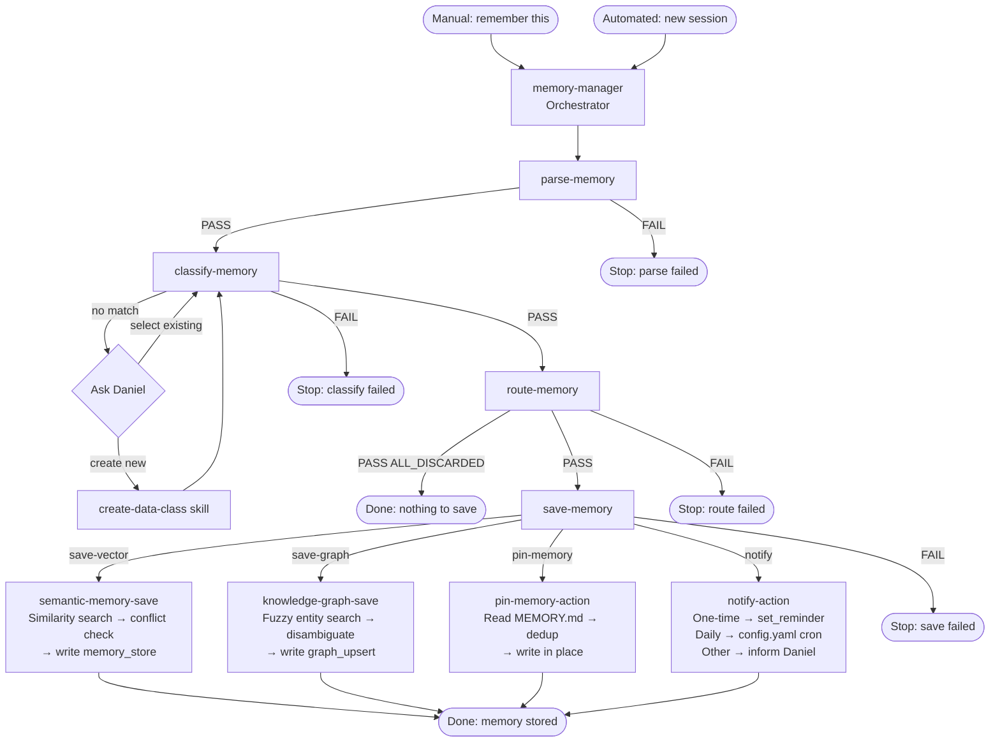

# Memory Management — Reference Documentation

> Designed 2026-03-05. Full lifecycle for storing, classifying, routing, and saving memory in Hive Mind.

---

## Workflow Overview

The memory management system is triggered one of two ways:

**Manual** — Daniel says "remember this" (a specific item or the current thread).
**Automated** — A new session starts and the transcript needs processing.

From there, four sub-agents run in sequence. Each must pass before the next begins. The orchestrator (`memory-manager`) coordinates them, passing a shared session temp directory between each step. That directory holds a chain of manifests — the output of each agent is the input of the next.

**The manifest chain:**

```
[input] → parse-memory → chunk-manifest.md
                       → classify-memory → classified-manifest.md
                                        → route-memory → routing-manifest.md
                                                       → save-memory → [writes to stores]
```

If any agent returns `FAIL`, the pipeline stops and Daniel is informed at which step and why. If all chunks are classified as `discard`, the pipeline exits cleanly after `route-memory` with no writes.

---

## Flow Diagram



---

## Skills

### `memory-manager`

> `.claude/skills/memory-manager/SKILL.md`

```
---
name: memory-manager
description: Orchestrates the full memory storage lifecycle. Triggers on "remember this" (manual) or new session start (automated). Runs parse-memory → classify-memory → route-memory → save-memory in sequence. Use when memory needs to be stored from a conversation or transcript.
user-invocable: true
---

# Memory Manager

Orchestrates memory storage. Runs four sub-agents in sequence. Each must pass before the next runs.

## Triggers

- Manual: user says "remember this" (single item or thread)
- Automated: new session starts (full transcript)

## Setup

Create a session temp directory: /tmp/memory-{timestamp}/
All sub-agents write their manifests here. Pass the path forward to each agent.

## Step 1 — parse-memory

Invoke the parse-memory agent with:
- Trigger type: manual or automated
- If manual: the content or thread to remember
- If automated: the full session transcript
- Session temp path

On RESULT: PASS → proceed to Step 2.
On RESULT: FAIL → stop. Report: "Memory storage failed at parse step: {reason}"

## Step 2 — classify-memory

Invoke the classify-memory agent with:
- Session temp path (reads chunk manifest written by parse-memory)

On RESULT: PASS → proceed to Step 3.
On RESULT: FAIL → stop. Report: "Memory storage failed at classify step: {reason}"

## Step 3 — route-memory

Invoke the route-memory agent with:
- Session temp path (reads classified manifest from classify-memory)

On RESULT: PASS → proceed to Step 4.
On RESULT: PASS | ALL_DISCARDED → stop. Report: "Nothing to save — all chunks were classified as transient."
On RESULT: FAIL → stop. Report: "Memory storage failed at route step: {reason}"

## Step 4 — save-memory

Invoke the save-memory agent with:
- Session temp path (reads routing manifest from route-memory)

On RESULT: PASS → report: "Memory stored successfully."
On RESULT: FAIL → report: "Memory storage failed at save step: {reason}"

## Cleanup

Delete the session temp directory after Step 4 completes (pass or fail).
```

---

### `semantic-memory-save`

> `.claude/skills/semantic-memory-save/SKILL.md`

```
---
name: semantic-memory-save
description: Procedure for writing a memory chunk to the vector store. Use when save-memory is processing a chunk routed to save-vector. Handles similarity search, conflict detection, and user resolution before writing.
user-invocable: false
---

# Semantic Memory Save

Governs how save-memory writes chunks to the vector store. Load once per run for all save-vector chunks.

## Step 1 — Similarity Search

Run semantic similarity search using the chunk content as the query. Threshold: cosine > 0.85.

## Step 2 — Evaluate Results

No similar entries found → write directly, done.

Similar entries found → assess conflict:
- Content is clearly distinct despite surface similarity → write directly.
- Content covers the same topic or fact → surface to Daniel (Step 3).

## Step 3 — Prompt Daniel

Present the incoming chunk and conflicting entries. Suggest the most appropriate option based on content:

1. Supersedes old data → delete conflicting rows, write new chunk.
2. Update, keep history → write new chunk with reference field linking to prior iteration(s). Both remain.
3. Additional context, both valid → write new chunk alongside existing. No deletion.

If Daniel says something outside these options, interpret intent and confirm before acting.

## Step 4 — Write

Call memory_store with chunk content, data class, tags, and any reference fields from Step 3.

## Notes

- Never silently overwrite. Always surface conflicts before deleting.
- "Keep history" is the safest default when uncertain — suggest it first.
- Reference fields for chained history go in the memory entry's metadata.
```

---

### `knowledge-graph-save`

> `.claude/skills/knowledge-graph-save/SKILL.md`

```
---
name: knowledge-graph-save
description: Procedure for writing a memory chunk to the knowledge graph. Use when save-memory is processing a chunk routed to save-graph. Handles fuzzy entity search, disambiguation, and user resolution before writing.
user-invocable: false
---

# Knowledge Graph Save

Governs how save-memory writes chunks to the knowledge graph. Load once per run for all save-graph chunks.

## Step 1 — Fuzzy Entity Search

Search the graph for entities matching the chunk's subject using graph_query. Do not require exact match — look for close variants, aliases, near-duplicates.

## Step 2 — Evaluate Results

No matches → proceed to write. Every node must have at least one edge — if no relationship can be established from the chunk, surface this to Daniel before creating an isolated node.

One clear match → upsert using graph_upsert. Update properties per the data class spec.

Multiple possible matches → do not write. Surface to Daniel (Step 3).

## Step 3 — Prompt Daniel (multiple matches only)

Present the incoming entity and candidate matches. Suggest the most likely match, let Daniel decide:

- Matches one of these → upsert into selected node.
- New distinct entity → create new node.
- Two existing nodes should be merged → merge, then upsert.
- Add as relationship only → create edge, no new node.

## Step 4 — Write

Call graph_upsert with entity type, name, properties, and relationship fields per data class spec and Daniel's decision.

## Notes

- Isolated nodes (no edges) are a red flag — always flag before creating.
- Fuzzy search is intentional: typos and aliases are common in conversational input.
- When merging nodes, preserve all existing relationships from both before deleting one.
```

---

### `notify-action`

> `.claude/skills/notify-action/SKILL.md`

```
---
name: notify-action
description: Procedure for handling a memory chunk with the notify action. Use when save-memory encounters a chunk that requests a future alert. Determines whether to call set_reminder, add a scheduler entry, or inform Daniel the feature is unsupported.
user-invocable: false
---

# Notify Action

The notify action means: this chunk is a request for a future alert. Determine which case applies.

## Case 1 — One-time reminder

Criteria: single specific future datetime, no recurrence pattern.
Examples: "remind me at 10am about the mulch delivery", "remind me tomorrow to call the doctor"

1. Extract message and target time from the chunk.
2. Call set_reminder(message, when).
3. Done — SQLite row self-destructs after firing.

Edge case — time already past: discard the notify action. Inform Daniel it was skipped and why.

## Case 2 — Daily recurring

Criteria: request to fire at the same time every day, indefinitely.
Examples: "remind me every morning at 7am to take my vitamins"

1. Extract message and daily time.
2. Create or update a skill under `minds/ada/.claude/skills/<skill-name>/SKILL.md` with `schedule:` and `schedule_timezone:` in its frontmatter (e.g., `schedule: "0 7 * * *"`, `schedule_timezone: "America/Chicago"`).
3. Notify Daniel: this is added and requires a scheduler container restart to take effect.
4. Note: this runs indefinitely — removal requires editing the skill's frontmatter (or deleting the skill) and restarting the scheduler.

## Case 3 — Non-daily recurring (unsupported)

Criteria: recurrence pattern that is not daily — weekly, monthly, yearly, custom (e.g., "every July 13th").

→ Feature does not exist yet. Tell Daniel:
"Recurring reminders with patterns other than daily are not yet supported.
 Your reminder has not been set. See backlog card: [Feature] Recurring Reminders / Timed Events."

Do not write to set_reminder or config.yaml. Do not silently discard.

Update this spec when the recurring reminder feature is built.
```

---

### `pin-memory-action`

> `.claude/skills/pin-memory-action/SKILL.md`

```
---
name: pin-memory-action
description: Procedure for writing a memory chunk to MEMORY.md. Use when save-memory encounters a chunk with the pin-memory action. The data class has already decided it belongs in MEMORY.md — this skill covers how to write it correctly.
user-invocable: false
---

# Pin Memory Action

The data class determined this content belongs in MEMORY.md. Follow these steps to write it correctly.

## Step 1 — Read MEMORY.md

Read the full contents before writing. Look for existing content covering the same topic or fact.

## Step 2 — Check for duplicates

Same fact verbatim → skip, no write needed.
Related content in same section → update in place, do not append a duplicate.
No related content → proceed to Step 3.

## Step 3 — Determine placement

Find the most appropriate existing section. If none fits, create a new section with a clear heading.
Session-specific notes → "Session Notes — [date]" section only, not permanent sections.

## Step 4 — Write

- Concise — MEMORY.md truncates after 200 lines. Every line must earn its place.
- Short declarative statement of durable fact.
- Match existing style: plain sentences, no fluff, no hedging.
- Do not repeat context already captured elsewhere in the file.

## What does NOT belong in MEMORY.md

- Session-specific context not relevant in future conversations.
- Anything already in vector store or knowledge graph that doesn't need immediate context on every conversation.
- Speculative or unverified facts.
```

---

### `create-data-class`

> `.claude/skills/create-data-class/SKILL.md`

```
---
name: create-data-class
description: Creates a new data class spec file in specs/data-classes/ and registers it in the index. Use when classify-memory encounters content that doesn't fit any existing class, or when Daniel requests a new class directly.
user-invocable: true
---

# Create Data Class

Creates a new data class spec and registers it in the index. Follow in order.

## Step 1 — Name check

Read specs/data-classes/index.md. Review all existing class names.
New name must not create ambiguity — no synonyms, no overlap in meaning with existing classes.
If the proposed name is too close to an existing one, flag it and ask Daniel to choose a different name before proceeding.

## Step 2 — Description

Write a description answering:
1. What kind of content belongs in this class?
2. What does it look like — what are the distinguishing features that make it recognizable?

Criteria:
- One to three sentences max.
- Specific enough that classify-memory can match without ambiguity.
- Includes "recognizable by" signals, not just category labels.

Bad: "Information about people."
Good: "A named individual — recognizable by a person's name as the subject, with associated facts about their role, relationship to Daniel, or preferences."

## Step 3 — Actions

Assign one or more actions:

- discard — no storage, no action (exclusive — cannot combine)
- save-vector — write to semantic vector store
- save-graph — write to knowledge graph
- pin-memory — append to MEMORY.md
- notify — set a reminder or scheduled alert

Any combination of non-discard actions is valid. Choose only what the class genuinely requires.

## Step 4 — Write the spec file

Create specs/data-classes/<class-name>.md:

# Data Class: <name>

## Description
<from Step 2>

## Actions
<from Step 3>

## Notes
<edge cases, examples, guidance for classify-memory>

## Step 5 — Update the index

Add a row to specs/data-classes/index.md: Class Name | Spec File | Storage Bucket | one-line Description.

## Format note

Spec files are read by Ada, not humans. Write minimally. No padding, no preamble. Every line must carry information.
```

---

## Agents

### `parse-memory`

> `.claude/agents/parse-memory.md`

```
---
name: parse-memory
description: Step agent that parses input into a chunk manifest for memory storage. Handles both manual triggers (remember this) and automated session transcript ingestion. Writes chunk-manifest.md to the session temp path.
tools: Read, Write, Bash
model: sonnet
maxTurns: 20
---

# parse-memory

Parse input into discrete memory chunks and write a chunk manifest.

## Input

Parse from the prompt:
- trigger: manual or automated
- content: the item, thread, or transcript to process
- session_path: temp directory to write the manifest

## Process

### Path A — Manual trigger

1. Determine: is the user asking to remember a specific data item, or an entire thread?
2. If unclear → ask the user: "Should I remember this specific item, or the full conversation thread?"
3. Once confirmed → extract the relevant content and break into discrete chunks. Each chunk should be a single coherent fact, event, preference, or entity — not a wall of text.

### Path B — Automated trigger (new session)

1. Input is the full session transcript.
2. Parse into discrete chunks. Each chunk = one coherent memory candidate.
3. Exclude: greetings, filler, navigation messages, error messages with no informational content.

## Output

Write {session_path}/chunk-manifest.md:

# Chunk Manifest

## Chunk 1
{content of chunk}

## Chunk 2
{content of chunk}

One section per chunk. No classification yet — raw content only.

## Exit Protocol

On success: RESULT: PASS
On failure (could not parse, user did not clarify, write failed): RESULT: FAIL | {reason}
```

---

### `classify-memory`

> `.claude/agents/classify-memory.md`

```
---
name: classify-memory
description: Step agent that classifies each chunk in the chunk manifest against the data class index. Reads specs/data-classes/index.md, matches each chunk to a class, prompts the user if no match is found, and invokes create-data-class if a new class is needed. Writes classified-manifest.md to the session temp path.
tools: Read, Write, Bash
model: sonnet
maxTurns: 30
---

# classify-memory

Classify each chunk in the chunk manifest against the data class index.

## Input

Parse from the prompt:
- session_path: temp directory containing chunk-manifest.md

## Process

### Step 1 — Read index

Read specs/data-classes/index.md. Load all available data class names and their spec file paths.

### Step 2 — Read chunk manifest

Read {session_path}/chunk-manifest.md. Process each chunk in sequence.

### Step 3 — Classify each chunk

For each chunk:
1. Read the relevant data class spec files from the index.
2. Determine which class the chunk fits.
3. If it clearly fits one class → tag it.
4. If it fits multiple classes → choose the most specific one.
5. If it fits no class → prompt the user:
   "This chunk doesn't match any existing data class. Does it fit one of these, or should we create a new one?"
   List available classes with one-line descriptions.
   - User selects existing → tag with that class.
   - User says create new → invoke create-data-class skill. On completion, tag chunk with the new class.
   - User cannot decide → tag as discard and note the reason.

### Step 4 — Write classified manifest

Write {session_path}/classified-manifest.md:

# Classified Manifest

## Chunk 1
class: {class-name}
content:
{chunk content}

## Chunk 2
class: {class-name}
content:
{chunk content}

## Exit Protocol

RESULT: PASS if all chunks are classified (including any classified as discard).
RESULT: FAIL | {reason} if classification could not be completed.
```

---

### `route-memory`

> `.claude/agents/route-memory.md`

```
---
name: route-memory
description: Step agent that reads the classified manifest, opens each data class spec to determine the prescribed action, and writes a routing manifest. Discard chunks are resolved here and excluded from the routing manifest.
tools: Read, Write, Bash
model: sonnet
maxTurns: 20
---

# route-memory

Read the classified manifest, resolve prescribed actions, write a routing manifest.

## Input

Parse from the prompt:
- session_path: temp directory containing classified-manifest.md

## Process

### Step 1 — Read classified manifest

Read {session_path}/classified-manifest.md. Extract all chunks and their classes.

### Step 2 — Load class specs

For each unique class in the manifest, read the corresponding spec file from specs/data-classes/{class-name}.md. Extract the prescribed action(s).

### Step 3 — Write routing manifest

For each chunk:
- If action is discard → exclude from routing manifest (log reason).
- Otherwise → write an entry with chunk content, class, and action(s).

Write {session_path}/routing-manifest.md:

# Routing Manifest

## Chunk 1
class: {class-name}
actions: {save-vector | save-graph | pin-memory | notify}
content:
{chunk content}

If all chunks were discarded, write an empty routing manifest and exit with RESULT: PASS | ALL_DISCARDED.

## Exit Protocol

RESULT: PASS — routing manifest written with at least one chunk.
RESULT: PASS | ALL_DISCARDED — all chunks were discard class, nothing to save.
RESULT: FAIL | {reason} — could not read specs, could not write manifest, or unresolvable error.
```

---

### `save-memory`

> `.claude/agents/save-memory.md`

```
---
name: save-memory
description: Step agent that executes memory writes from the routing manifest. Loads save specs once per run, processes each chunk per its destination, handles conflict detection and user interaction, then executes writes via memory_store and graph_upsert.
tools: Read, Write, Bash
model: sonnet
maxTurns: 50
---

# save-memory

Execute memory writes for all chunks in the routing manifest.

## Input

Parse from the prompt:
- session_path: temp directory containing routing-manifest.md

## Process

### Step 1 — Read routing manifest

Read {session_path}/routing-manifest.md. Extract all chunks with their classes and actions.

### Step 2 — Load save specs once

Scan the manifest for all action types present:
- Any save-vector chunks → read .claude/skills/semantic-memory-save/SKILL.md once.
- Any save-graph chunks → read .claude/skills/knowledge-graph-save/SKILL.md once.
- Any pin-memory chunks → read .claude/skills/pin-memory-action/SKILL.md once.
- Any notify chunks → read .claude/skills/notify-action/SKILL.md once.

Do not reload specs per chunk — load once, apply to all relevant chunks.

### Step 3 — Process each chunk

For each chunk in the manifest, apply the procedure from the loaded spec for each of its actions.
A chunk may have multiple actions — execute all of them.

Follow the spec exactly: run searches before writing, surface conflicts to Daniel, wait for decisions before acting.

### Step 4 — Confirm

After all chunks are processed, report a brief summary:
- How many chunks saved to vector store
- How many saved to knowledge graph
- How many pinned to MEMORY.md
- How many reminders set
- Any skipped or failed

## Exit Protocol

RESULT: PASS — all chunks processed (saved, notified, or intentionally skipped with user input).
RESULT: FAIL | {reason} — a write failed, a spec could not be loaded, or an unresolvable error occurred.
```
