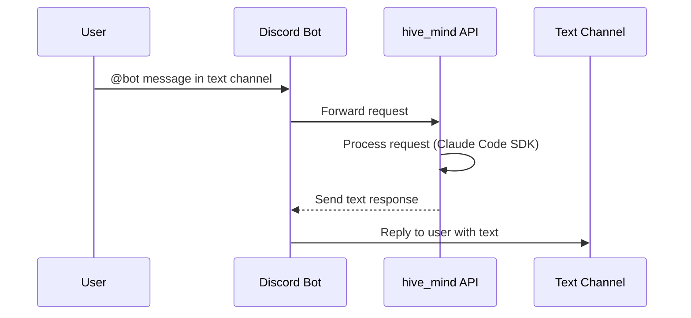
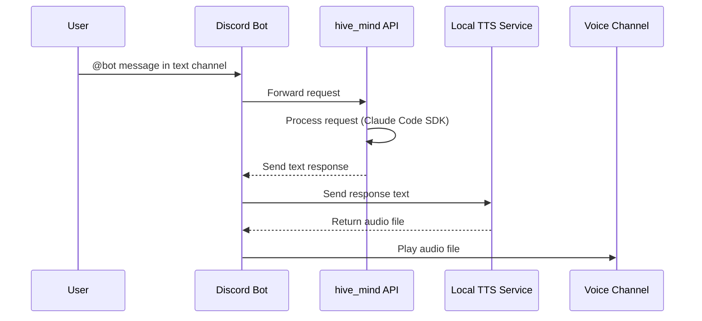
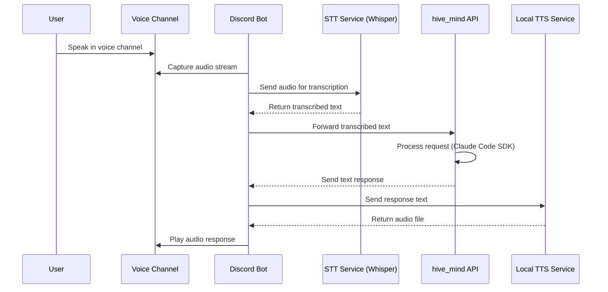

# Voice & Web Refactor Plan

**Date:** 2026-02-16
**Branch:** `refactor/claude-code-cpu`
**Supersedes:** Custom web UI (`web_app.py`, `web/`), terminal wrapper (`terminal_app.py`, `services/`)

---

## Motivation

The current web interface (`web_app.py` + `web/`) is a custom FastAPI + WebSocket chat UI with voice support. The security review (`documents/SEC_REVIEW.md`) identified **9 findings directly caused by this component**, including one CRITICAL. Rather than patching each issue individually — adding auth middleware, CORS, origin validation, input schemas, TLS, etc. — we eliminate the entire attack surface by replacing it with a Discord bot.

Discord provides all of the above for free: OAuth2 authentication, encrypted transport, rate limiting, input validation, origin enforcement, and a mature client on every platform.

---

## What Gets Removed

### Files

| File | Purpose |
|------|---------|
| `web_app.py` | FastAPI server, WebSocket handler, command routing |
| `web/index.html` | Chat UI shell |
| `web/static/app.js` | WebSocket client, voice recording, settings panel |
| `web/static/style.css` | Chat styling |
| `services/speech.py` | OpenAI Whisper STT + TTS + local audio playback |
| `services/claude_code.py` | Claude Code SDK wrapper (redundant — Claude Code is the terminal) |
| `services/claude_cli.py` | Claude CLI wrapper for Ollama backend |
| `terminal_app.py` | REPL wrapper around Claude Code (redundant) |
| `start_dev.sh` | Dev launcher script |

### Infrastructure

- `WEB_PORT` config (`config.yaml`, `config.py`, `.env`)
- Docker `EXPOSE 7780`, compose port mapping, and `CMD` running uvicorn/web_app
- WebSocket-based voice pipeline (browser MediaRecorder -> base64 -> server STT/TTS -> base64 audio back)
- Voice dependencies in `requirements.txt`: `sounddevice`, `numpy`, `pydub`, `keyboard`
- Web dependencies in `requirements.txt`: `fastapi`, `websockets`, `jinja2`

---

## Security Findings Resolved

Removing the web component **fully resolves 9 of 21** findings from `SEC_REVIEW.md`:

| ID | Severity | Finding | Resolution |
|----|----------|---------|------------|
| **CRITICAL-4** | CRITICAL | No authentication on any endpoint | Discord handles authentication via OAuth2 + bot tokens. Only users in the server can interact. |
| **HIGH-3** | HIGH | Global config shared across connections | No more concurrent web connections. Terminal remains single-user. Discord bot uses per-guild/per-channel context. |
| **MEDIUM-1** | MEDIUM | No input validation on WebSocket messages | No more WebSocket. Discord validates message format. |
| **MEDIUM-2** | MEDIUM | Error messages leak internal details | No more raw exception forwarding to clients. Bot controls what gets sent to Discord. |
| **MEDIUM-3** | MEDIUM | No CORS policy | No more HTTP endpoints exposed to browsers. |
| **MEDIUM-4** | MEDIUM | No WebSocket origin validation | No more WebSocket. |
| **MEDIUM-7** | MEDIUM | Prompt injection surface (web) | Web system prompt and `/backend` command injection path removed. Discord bot has a narrower, controlled input surface. |
| **LOW-1** | LOW | No HTTPS/WSS | Discord API uses TLS. No plaintext transport. |
| **LOW-2** | LOW | Predictable session IDs | No more `id(websocket)` sessions. Discord provides unique user/channel/guild IDs. |
| **LOW-4** | LOW | Auto-reconnect without backoff | No more browser WebSocket client. Discord.js handles reconnection with built-in backoff. |

### Findings That Remain Open

These are unrelated to the web component and must still be addressed separately:

| ID | Severity | Finding |
|----|----------|---------|
| CRITICAL-1 | CRITICAL | Arbitrary code execution via `create_tool` |
| CRITICAL-2 | CRITICAL | Arbitrary package installation |
| CRITICAL-3 | CRITICAL | All AI permissions bypassed |
| HIGH-1 | HIGH | Secrets in plaintext `.env` |
| HIGH-2 | HIGH | `set_secret` can overwrite critical env vars |
| HIGH-4 | HIGH | Docker runs as root |
| HIGH-5 | HIGH | Docker volume mounts expose host filesystem |
| MEDIUM-5 | MEDIUM | Secret length disclosure |
| MEDIUM-6 | MEDIUM | Non-deterministic Docker base image |
| MEDIUM-8 | MEDIUM | Inconsistent secret file loading (Neo4j) |
| LOW-3 | LOW | Variable shadowing in Neo4j agent |

---

## Replacement: Discord Bot

### Architecture

```
User (Discord text/voice channel)
    → Discord Bot (Node.js, discord.js + @discordjs/voice)
    → Hive Mind API (FastAPI, minimal authenticated endpoint)
    → Claude Code SDK
    → MCP Tools
```

The Discord bot becomes the **only network-facing interface**. The hive_mind backend exposes a single authenticated API endpoint that the bot calls over localhost.

### Text Channel Workflow

User @mentions the bot in a text channel. The bot forwards the message to hive_mind, receives the response, and replies in the same channel tagging the user.



### Voice Channel Workflow (TTS)

Same text flow, but the bot additionally sends the response text to a local TTS service, receives audio, and plays it in the user's voice channel.



### Voice Input Workflow (STT)

For voice-to-voice interaction, the bot listens in the voice channel, captures audio, sends it to the STT service, and processes the transcribed text through hive_mind.



---

## Discord Bot Technical Details

### Stack

- **Runtime:** Node.js
- **Library:** discord.js v14+
- **Voice:** @discordjs/voice (Opus encoding, libsodium)
- **Audio playback:** `createAudioPlayer` + `createAudioResource`

### Bot Permissions Required

- `Send Messages` — reply in text channels
- `Read Message History` — context for conversations
- `Connect` — join voice channels
- `Speak` — play TTS audio in voice channels
- `Use Voice Activity` — optional, for STT listening

### Key Code Pattern (Voice Playback)

```js
const { joinVoiceChannel, createAudioPlayer, createAudioResource } = require('@discordjs/voice');

const connection = joinVoiceChannel({
  channelId: member.voice.channel.id,
  guildId: guild.id,
  adapterCreator: guild.voiceAdapterCreator,
});

const player = createAudioPlayer();
const resource = createAudioResource('/path/to/tts-output.mp3');
player.play(resource);
connection.subscribe(player);
```

### Communication with hive_mind

A minimal FastAPI endpoint authenticated with a shared secret, bound to `127.0.0.1` (localhost only):

```
POST /api/chat
Authorization: Bearer <BOT_API_KEY>
Content-Type: application/json

{ "message": "user's message", "user_id": "discord_user_id" }
```

Simple, language-agnostic, and keeps the bot isolated from Python internals. No public exposure.

### New Config Values

```ini
# Discord
DISCORD_BOT_TOKEN=...
DISCORD_GUILD_ID=...           # Optional: restrict to specific server
BOT_API_KEY=...                # Shared secret between bot and API
```

---

## Implementation Steps

### Phase 1: Remove Web Component + Redundant Wrappers

1. Delete `web_app.py`, `web/` directory
2. Delete `terminal_app.py`, `services/` directory, `start_dev.sh`
3. Remove `WEB_PORT` from `config.py`, `config.yaml`, `.env`
4. Remove Docker web port exposure (`EXPOSE 7780`, compose port mapping)
5. Strip unused dependencies from `requirements.txt`
6. Update `CLAUDE.md` file structure and quick start sections
7. Update `SEC_REVIEW.md` — mark 9 findings as "Resolved (web component removed)"

The terminal interface is now Claude Code itself (via `claude` CLI + `.mcp.json` for MCP tools).
Backend/model switching (`/backend ollama`, `/model gpt-oss:20b`) will be handled as Claude Code slash commands or config file updates (workflow TBD).

### Phase 2: Build Discord Bot

1. Initialize Node.js project in `discord_bot/` directory
2. Implement basic text channel interaction (@mention → hive_mind → reply)
3. Add authenticated API endpoint to hive_mind (`POST /api/chat` on localhost)
4. Add voice channel join/leave commands
5. Integrate TTS: response text → local TTS service → audio playback in voice channel
6. Integrate STT: voice channel audio → Whisper → transcribed text → hive_mind

### Phase 3: Harden Remaining Issues

Address the 11 findings from SEC_REVIEW.md that are unrelated to the web component (CRITICAL-1 through LOW-3 as listed above).

---

## What Stays

- **Claude Code CLI** — the terminal interface (no wrapper needed)
- **`.mcp.json`** — wires MCP tools into Claude Code
- **`mcp_server.py`** — MCP tool discovery and serving
- **`agents/`** — MCP tool implementations
- **`config.py` + `config.yaml`** — centralized config
- **`CLAUDE.md`** — system prompt and project docs
- **Docker** — containerizes the MCP server

STT/TTS will be reimplemented in Phase 2 as part of the Discord bot (likely using the same OpenAI Whisper/TTS APIs, but called from the bot side rather than the Python backend).
