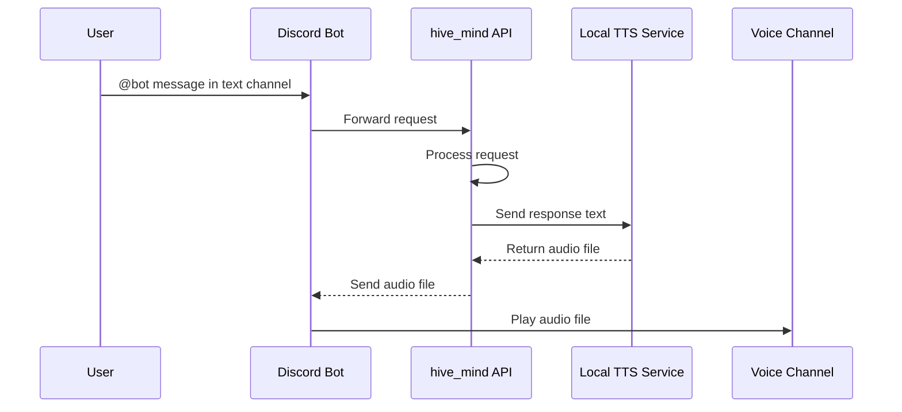
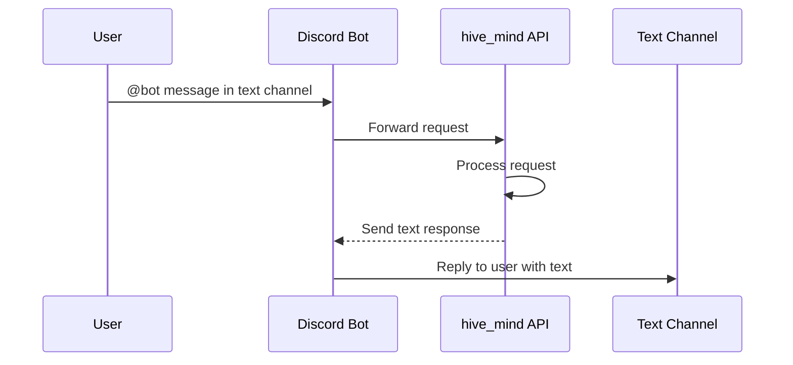

1) claude wrapper
    - voice (output) integration via local TTS linux service & discord app (bot)
    - voice / text (input) integration via discord app (bot)

## Workflow Diagrams

### Voice Channel Workflow (TTS)

User sends a message in a text channel tagging the bot. The bot forwards the request to the hive_mind API, which processes it and sends the output to a local TTS service. The TTS service generates an audio file, which hive_mind returns to the bot. The bot then joins (or is already in) the user's voice channel and plays the audio.



### Text Channel Workflow

Same flow but skips the TTS step entirely. The bot tags the user and replies with the hive_mind response as a text message in the channel.



## Code Reference

### Discord Bot Voice Channel Playback (discord.js + @discordjs/voice)

```js
const { joinVoiceChannel, createAudioPlayer, createAudioResource } = require('@discordjs/voice');

// Join the user's voice channel
const connection = joinVoiceChannel({
  channelId: member.voice.channel.id,
  guildId: guild.id,
  adapterCreator: guild.voiceAdapterCreator,
});

// Play the TTS audio file returned by hive_mind
const player = createAudioPlayer();
const resource = createAudioResource('/path/to/tts-output.mp3');
player.play(resource);
connection.subscribe(player);
```
