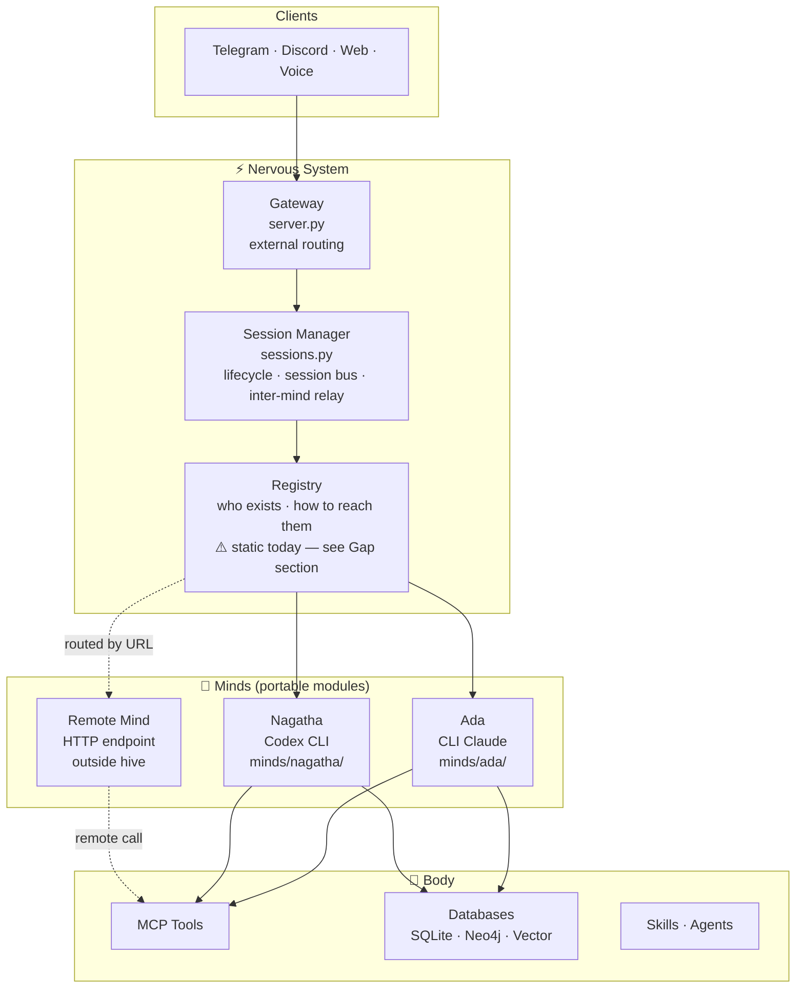

# Mind-to-Mind Messaging Architecture Spec

## Overview

A message broker system enabling asynchronous, stateless communication between minds. The broker owns all state and routing. Minds are stateless workers. Complexity is distributed to participants via schema-enforced HTTP calls, not centralized in the broker.

---

## Core Design Principles

1. **The broker is dumb** — it is infrastructure, not a participant. It stores, routes, and injects context. It does not summarize or reason.
2. **Minds are stateless workers** — every activation is a fresh session. Context is injected by the broker at wakeup.
3. **The caller pays for context** — the initiating mind owns the conversation state and bears the context cost. The callee gets a minimal, clean session.
4. **The rolling summary is the contract** — the sending mind is responsible for summarizing all prior turns before sending. The callee never looks up history. Everything it needs arrives in the wakeup prompt.

---

## Hive Mind Architecture Mapping

| Abstract Component | Hive Mind Implementation |
|---|---|
| Minds | `ada`, `nagatha`, `bob`, `bilby` — defined in `config.yaml` |
| Broker | New `hive_mind_broker` FastAPI container, port `9422` |
| Broker storage | SQLite (`data/broker.db`) — two tables: `conversations`, `messages` |
| Send (caller) | Skill POSTs to `http://hive_mind_broker:9422/messages` |
| Check (poller) | Agent GETs from `http://hive_mind_broker:9422/results/{task_id}` |
| Mind wakeup | Broker calls gateway `POST /sessions` → `POST /sessions/{id}/message` |
| Polling agent | `.claude/agents/poll-task-result.md` — markdown agent file, harness-spawned, runs non-blocking |
| Conversation ID | UUID generated by initiating mind at conversation start |

**Accessibility:** The broker must be reachable by minds both inside and outside the `hive_mind` container. Minds inside call it over the Docker network; minds running outside call it via the exposed host port. The broker is the only service that wakes minds via the gateway.

---

## Database Schema

### `conversations` table

One row per task. Created by the initiating mind's first POST.

| Column | Type | Notes |
|---|---|---|
| `id` | UUID | Generated by initiating mind |
| `from_mind` | TEXT | e.g. `ada` |
| `to_mind` | TEXT | e.g. `nagatha` |
| `status` | TEXT | `active` \| `complete` |
| `created_at` | TIMESTAMP | |

### `messages` table

One row per turn. Append-only.

| Column | Type | Notes |
|---|---|---|
| `id` | UUID | |
| `conversation_id` | UUID | FK → `conversations.id` |
| `from_mind` | TEXT | |
| `to_mind` | TEXT | |
| `message_number` | INT | Ordering within the conversation — audit only, callee never uses it |
| `type` | TEXT | `TASK \| RESULT \| NOTIFY \| DONE` |
| `content` | TEXT | The actual message |
| `rolling_summary` | TEXT | Summary of all prior turns, provided by the sender |
| `timestamp` | TIMESTAMP | |

Conversations are queryable by `from_mind` / `to_mind` for auditing. Records can be cleared by `conversation_id` once a conversation is complete.

---

## Architecture Components

### 1. Message Broker (`hive_mind_broker`)

A new FastAPI container with SQLite-backed storage. Responsibilities:

- Receive messages from minds via HTTP POST
- Write to `conversations` (first turn only) and `messages` tables
- Wake the callee by creating a session via the gateway and posting the injected wakeup prompt
- Handle termination: intercept `DONE`-type messages, mark conversation complete, do not forward
- Enforce max turn limits as a safety net

The broker does **not** run a mind. It is a database with routing logic and a gateway client.

### 2. The Send Skill (`send-message-to-mind`)

`.claude/skills/send-message-to-mind/SKILL.md`

This skill instructs the sending mind exactly what to POST and when to include a rolling summary.

**POST to `http://hive_mind_broker:9422/messages`**

```json
{
  "conversation_id": "uuid",
  "from": "ada",
  "to": "nagatha",
  "type": "TASK | RESULT | NOTIFY | DONE",
  "content": "the message",
  "rolling_summary": "..."
}
```

**Rolling summary rules — the skill must make these explicit:**

- **Turn 1 (first message):** `rolling_summary` is empty. Nothing has happened yet.
- **Turn 2 (reply):** `rolling_summary` must summarize the first message sent and the reply received.
- **Turn 3+:** `rolling_summary` must summarize the entire conversation so far — every message sent and every reply received, in order. This is a new session for the receiving mind. It has no memory of prior turns. The summary is its only history.

The skill must explicitly instruct: *"If this is not the first message in the conversation, you must write a rolling summary of everything that has happened before this message — your messages and the other mind's responses — before calling POST."*

After POSTing, the skill spawns the polling agent (`poll-task-result`) with the `conversation_id`, then exits.

### 3. The Polling Agent (`poll-task-result`)

`.claude/agents/poll-task-result.md`

A markdown agent file. The harness spawns it as a subprocess with only the `conversation_id` given to it. Runs non-blocking.

Its logic:
```
repeat up to N times (default: 20 ≈ 10 minutes):
  GET http://hive_mind_broker:9422/results/{conversation_id}
  if result found: deliver result to caller's next session, exit
  wait 30 seconds
if N exceeded: deliver timeout notice to caller's next session, exit
```

No skill needed — the agent's job is too simple for one.

### 4. Results Store

Completion signals do **not** travel back through the messages table. The callee POSTs its result to a separate endpoint when its work is done:

`POST /results/{conversation_id}` → broker writes to a `results` table, marks conversation complete.

The polling agent GETs from `GET /results/{conversation_id}` until it finds an entry.

---

## Message Flow

### Delegation Flow (Async)

```
1. Ada's skill generates a conversation_id (UUID)
2. Ada's skill POSTs to /messages:
     { conversation_id, from: "ada", to: "nagatha", type: "TASK",
       content: "...", rolling_summary: "" }
3. Broker writes to conversations (new row) and messages (turn 1)
4. Broker wakes Nagatha via gateway:
     POST /sessions  → new Nagatha session
     POST /sessions/{id}/message with injected wakeup prompt:
       "You have a new message from Ada.
        [rolling_summary if turn 2+]
        Message: [content]
        When done, POST your result to http://hive_mind_broker:9422/messages"
5. Ada's skill spawns poll-task-result agent (conversation_id), then exits
6. Nagatha does the work. Session is fresh — full context was injected, nothing to look up.
7. Nagatha POSTs result to /messages (type: RESULT, with rolling_summary of the exchange)
8. Broker writes result, wakes Ada OR polling agent picks it up
9. Ada's next session receives the result in context
```

### Multi-Turn Flow

If Nagatha's result requires a follow-up from Ada:

- Ada receives the result, writes a rolling summary of both turns, POSTs a new message (turn 3)
- The skill explicitly requires the rolling summary at this point — Nagatha's next session is fresh and knows nothing
- Nagatha wakes with: summary of turns 1–2 + the new message
- This continues until one side sends `type: DONE`

### Termination

- `type: DONE` is intercepted by the broker — not forwarded, conversation marked complete
- Broker enforces hard limits: max turns, timeout

---

## Wakeup Prompt (Broker → Callee)

The broker constructs this and POSTs it to the callee's new gateway session:

```
You have a new message from {from_mind}.

{if turn > 1:}
Summary of conversation so far:
{rolling_summary}

New message:
{content}

When you have completed your work, POST your response to:
  http://hive_mind_broker:9422/messages
with your result and an updated rolling summary.
```

The callee has everything it needs. No tool calls to look up history. No cursor. No message numbers. The rolling summary is the complete history.

---

## Broker Container Spec

```
hive_mind_broker/
├── server.py          # FastAPI app — POST /messages, GET /results, wakeup logic
├── db.py              # SQLite setup — conversations, messages, results tables
├── gateway_client.py  # Thin HTTP client for POST /sessions and /sessions/{id}/message
├── Dockerfile
└── requirements.txt
```

**Endpoints:**

| Method | Path | Purpose |
|---|---|---|
| `POST` | `/messages` | Receive message, write to DB, wake callee |
| `GET` | `/results/{conversation_id}` | Poll for result (polling agent) |
| `POST` | `/results/{conversation_id}` | Write result (called by callee when done) |

**docker-compose.yml addition:**
```yaml
hive_mind_broker:
  build: ./hive_mind_broker
  ports:
    - "9422:9422"
  volumes:
    - ./data:/app/data
  environment:
    - GATEWAY_URL=http://hive_mind:8420
  depends_on:
    - hive_mind
```

---

## Cost Model

| Role | Context Cost | Why |
|---|---|---|
| Orchestrator (Ada) | Higher | Owns conversation state, writes rolling summary, tracks multiple delegations |
| Worker (Nagatha / Bob) | Minimal | Receives pre-summarized context, pays only for the work |

**Discipline incentive:** If the caller writes a verbose, unsummarized rolling summary, it inflates the callee's context and its own next session. The cost model naturally enforces tight, clean summaries.

---

## What the Broker Does NOT Do

- Run a mind or generate summaries
- Maintain long-running mind sessions
- Act as a conversation participant
- Forward `DONE`-flagged messages to the recipient
- Hold global conversation state (pairwise queries are derivable from the DB)

---

## Optional Optimizations (Non-core)

- **Summary checkpoint at depth** — broker requests a fresh summary from the caller every N turns, stored in conversation metadata
- **Priority routing** — broker routes urgent messages ahead of background tasks
- **Dead letter handling** — failed deliveries land in a separate table for inspection
- **Audit queries** — `SELECT * FROM conversations WHERE from_mind='ada' AND to_mind='bilby'`

---

## Summary

The broker is a dumb router. The two-table database is the transcript. The rolling summary makes session resets irrelevant — the callee always wakes with full context. The caller pays for context; the callee pays only for work.

In Hive Mind terms: Ada orchestrates, Nagatha and Bob work, the broker routes, and the gateway wakes whoever is next.

---

## Three-Layer Model

The architecture decomposes into three portable layers. Each can be reasoned about, deployed, and scaled independently.

```
Mind            — the AI process. Identity, soul, backend. Speaks one protocol.
Nervous System  — routing bus. Knows where every mind is. Handles all message flow.
Body            — peripherals. Tools, databases, MCP, skills.
```

**Minimal viable standalone unit: one Mind + Nervous System + the Body subset that Mind needs.**

Extracting a mind from the hive: take its `minds/<name>/` directory, give it a Nervous System instance (local or remote), register it. The routing logic doesn't change — the registry entry switches from a local subprocess address to an HTTP endpoint.



The Nervous System is currently fragmented across `server.py` (external routing), `sessions.py` (lifecycle), and the not-yet-built Phase 4 broker (inter-mind). These three components answer the same question — *who are the minds and how do I reach them?* — and should be treated as a single layer.

### Two-Level Config

Per-mind config belongs in `minds/<name>/config.yaml` — everything needed to run that mind (backend, model, MCP config). This travels with the mind.

The top-level `config.yaml` holds a **routing registry only** — `mind_id` mapped to a local path or external URL:

```yaml
# config.yaml — routing registry only
minds:
  ada:     local: minds/ada
  nagatha: local: minds/nagatha
  skippy:  local: minds/skippy
  # future remote mind:
  # remote_mind: url: http://remote.example.com:8421
```

Each mind's own `minds/<name>/config.yaml` holds the implementation detail:

```yaml
# minds/ada/config.yaml
backend: cli_claude
model: sonnet
soul: souls/ada.md
mcp_config: .mcp.ada.json
```

---

## Gap: Dynamic Registration

> **Status: not yet designed. This section is a placeholder.**

Currently, mind registration is static — `config.yaml` must be edited and the container restarted to add or remove a mind. For drop-in modularity and remote minds to work, registration needs to be dynamic:

- A mind announces itself to the Nervous System
- The Nervous System acknowledges and adds it to the routing table
- No restart required; onboarding is a procedure, not a config edit

Design questions to resolve before implementing:

- What is the registration handshake? (HTTP endpoint? message on the bus?)
- How does the Nervous System verify a mind's identity?
- What happens when a registered mind goes offline — graceful deregister vs. timeout?
- Does the registry persist across Nervous System restarts?
- Can a mind re-register with a new address without losing session history?
