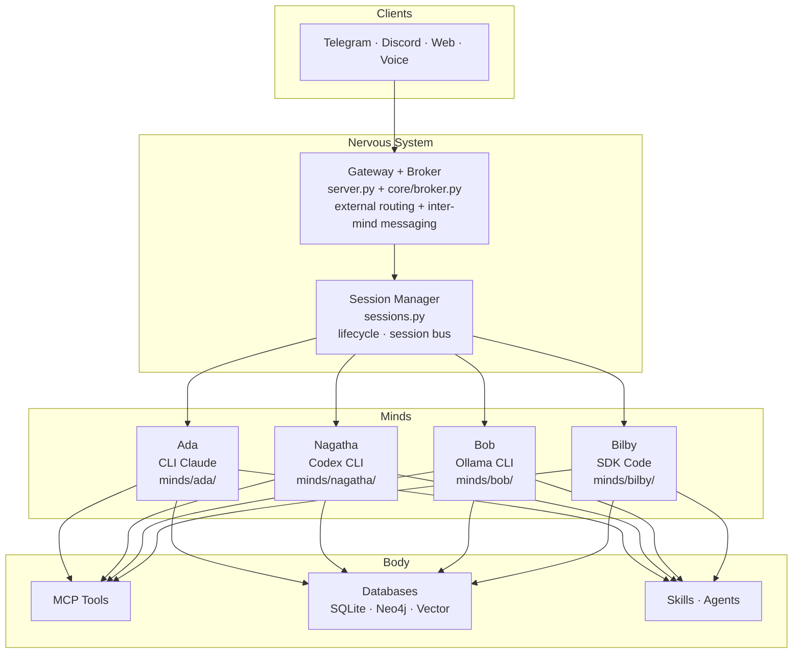

# Mind-to-Mind Messaging Architecture Plan

## Overview

A message broker system enabling asynchronous, stateless communication between minds. The broker owns all state and routing. Minds are stateless workers. The broker is integrated into the existing gateway server — no separate container.

---

## Phasing

### Phase 1 — Core Messaging (this implementation)

The message broker, wakeup flow, response collection, send skill, and polling agent. Everything needed for one mind to asynchronously delegate a task to another mind and receive the result.

**In scope:**
- Broker endpoints integrated into `server.py`
- SQLite storage (`data/broker.db`)
- Background task: wakeup callee, collect response from SSE stream, write to DB
- `send-message-to-mind` skill
- `poll-task-result` agent (Haiku agent wrapping a Python polling script)
- Notification on threshold exceeded

**Deferred to Phase 2+:**
- MIND.md migration (replacing config.yaml + souls/)
- cli_harness.py elimination
- Filesystem-driven mind registration / `minds` table
- Mind CRUD skills (create-mind, update-mind, remove-mind, add-mind, list-minds)
- Setup skills (/setup hierarchy)
- Claude plugin packaging
- Escalation phase (auto-kill, retry behavior)
- Identity verification for remote minds
- Hot-reload of MIND.md at runtime
- Local provider delegation

---

## Core Design Principles

1. **The broker is dumb** — it is infrastructure, not a participant. It stores, routes, and injects context. It does not summarize or reason.
2. **Minds are stateless workers** — every activation is a fresh session. Context is injected by the broker at wakeup.
3. **The caller pays for context** — the initiating mind owns the conversation state and bears the context cost. The callee gets a minimal, clean session.
4. **The rolling summary is the contract** — the sending mind is responsible for summarizing all prior turns before sending. The callee never looks up history. Everything it needs arrives in the wakeup prompt.

---

## Hive Mind Architecture Mapping

| Abstract Component | Hive Mind Implementation |
|---|---|
| Minds | `ada`, `nagatha`, `bob`, `bilby` — defined in `config.yaml` |
| Broker | New endpoints on the existing gateway (`server.py`), port `8420` |
| Broker storage | SQLite (`data/broker.db`) — two tables: `conversations`, `messages` |
| Send (caller) | Skill POSTs to `http://server:8420/broker/messages` |
| Check (poller) | Script GETs from `http://server:8420/broker/messages?conversation_id=<id>` |
| Mind wakeup | Gateway background task: `session_mgr.create_session()` → `session_mgr.send_message()` |
| Response collection | Gateway background task collects callee's full SSE response and writes to DB |
| Polling agent | `.claude/agents/poll-task-result.md` — Haiku agent wrapping a Python polling script |
| Conversation ID | UUID generated by initiating mind at conversation start |

**Integration rationale:** The broker's only jobs are storing messages and waking callees via the session manager. Since the gateway already owns the session manager, the broker is a natural extension of `server.py` — no new container, no network hops, direct access to `session_mgr` internals. The broker endpoints are namespaced under `/broker/` to keep them distinct from the existing gateway API.

---

## Database Schema

### `conversations` table

One row per task. Existence record only — routing info lives in `messages`, completion is implicit (callee's response present in `messages`).

| Column | Type | Notes |
|---|---|---|
| `id` | UUID | Generated by initiating mind |
| `created_at` | TIMESTAMP | |

### `messages` table

One row per turn. Append-only. Each row is self-describing — no JOIN needed to determine who sent what to whom.

| Column            | Type      | Notes                                                               |
| ----------------- | --------- | ------------------------------------------------------------------- |
| `id`              | UUID      | Caller-provided (enables idempotent retries)                        |
| `conversation_id` | UUID      | FK → `conversations.id`                                             |
| `from_mind`       | TEXT      | e.g. `ada`                                                          |
| `to_mind`         | TEXT      | e.g. `nagatha`                                                      |
| `message_number`  | INT       | Ordering within the conversation — audit only, callee never uses it |
| `content`         | TEXT      | The actual message                                                  |
| `rolling_summary` | TEXT      | Summary of all prior turns, provided by the sender                  |
| `metadata`        | JSON      | Optional. See Metadata Contract below.                              |
| `status`          | TEXT      | `pending`, `dispatched`, `completed`, `failed`, `timed_out`         |
| `recipient_session_id` | TEXT | Set by broker when callee session is created                        |
| `response_error`  | TEXT      | Error detail when `status` is `failed` or `timed_out`               |
| `timestamp`       | REAL      | Unix epoch                                                          |

**Constraints:**
- `UNIQUE(conversation_id, message_number)` — safety net against duplicate numbering
- `INDEX ON messages(conversation_id)` — polling queries filter by conversation
- `INDEX ON messages(status)` — startup recovery scans by status

Routing info (`from_mind`/`to_mind`) is on `messages` only. The parties of a conversation are derivable from the first message row. Records can be cleared by `conversation_id` once a result is present. The broker does not read `metadata` — it is for analysis and future heuristics only.

**Status lifecycle:**
- `pending` — message written to DB, background wakeup task not yet started
- `dispatched` — callee session created, wakeup sent, awaiting response
- `completed` — callee response collected and written as the next message
- `failed` — wakeup or response collection failed (detail in `response_error`)
- `timed_out` — collection backstop exceeded (detail in `response_error`)

**Idempotency:** The caller provides `message_id` in the POST body. If a row with that `id` already exists, the broker returns the existing message status — no duplicate is created. This handles client retries after timeouts.

### Collection Backstop

The broker's background task blocks on the callee's SSE stream, which can legitimately run for hours (e.g., a coding pipeline). There is no short timeout. Instead, a generous backstop is derived from `request_type`:

| `request_type`         | Backstop (8x notification threshold) |
| ---------------------- | ------------------------------------ |
| `quick_query`          | 40 min                               |
| `research`             | 160 min (~2.5 hr)                    |
| `code_review`          | 160 min (~2.5 hr)                    |
| `content_generation`   | 120 min (2 hr)                       |
| `data_analysis`        | 160 min (~2.5 hr)                    |
| `security_triage`      | 240 min (4 hr)                       |
| `security_remediation` | 720 min (12 hr)                      |
| (unknown/missing)      | 360 min (6 hr)                       |

On backstop expiry: `status='timed_out'`, callee session killed, `response_error` populated. This is a safety net — normal operation is governed by the polling agent's notification thresholds, not the backstop.

### Restart Recovery

On broker startup (`init_db`), scan for stranded messages from a previous process lifecycle:

- `status='pending'` (never dispatched) → re-dispatch via `wakeup_and_collect()`
- `status='dispatched'` (mid-flight when server died) → mark `status='failed'`, `response_error='server_restart_during_delivery'`

The callee session for `dispatched` messages is dead after restart — the session manager marks all running sessions as idle on startup. There is nothing to collect, so failure is the only correct state. The polling agent on the caller side will eventually hit its hard ceiling and notify.

### Metadata Contract

`metadata` is an optional JSON field on each message. The broker ignores it entirely. Its purpose is searchability and future analysis.

**`request_type` is the only required metadata field when `expects_reply` is true.** It determines the polling agent's notification threshold.

| `request_type`          | Description                                  | Notification threshold |
| ----------------------- | -------------------------------------------- | ---------------------- |
| `quick_query`           | Simple question, fast expected response      | 5 min                  |
| `research`              | Web lookup, CVE search, information gathering | 20 min                |
| `code_review`           | Reviewing a PR or implementation             | 20 min                 |
| `content_generation`    | Writing, summarising, formatting             | 15 min                 |
| `data_analysis`         | Query processing, log analysis               | 20 min                 |
| `security_triage`       | Incident detected, needs analysis            | 30 min                 |
| `security_remediation`  | Researched incident, needs a code fix        | 90 min                 |

**Full metadata shape:**

```json
{
  "request_type": "security_triage",
  "triggered_by": "user_request | autonomous_decision | scheduled_job",
  "expects_reply": true,
  "context_ref": "planka:card_123 | session:abc | log:2026-04-06T17:30:00"
}
```

All fields except `request_type` are optional. `priority` is intentionally absent — it is implied by `request_type` (e.g. `security_triage` is inherently high priority).

---

## Architecture Components

### 1. Message Broker (integrated into `server.py`)

New endpoints on the existing FastAPI gateway, backed by a separate SQLite database (`data/broker.db`). The broker module lives in `core/broker.py` — pure data layer with no FastAPI dependency. Routes are registered in `server.py`.

**Responsibilities:**

- Receive messages from minds via HTTP POST
- Write to `conversations` (first turn only) and `messages` tables
- Kick off a **background task** that wakes the callee, collects the full response, and writes it back to the `messages` table
- Return immediately to the caller with `{ status: "dispatched", conversation_id, message_id }`
- Enforce a hard maximum turn limit as a safety net (broker-side only, not visible to minds)

**Background task — wakeup and response collection:**

This is the key mechanism. When a message arrives, the broker:

1. Writes the outgoing message to DB with `status: "pending"`
2. Starts an `asyncio` background task (via `asyncio.create_task()`)
3. Returns immediately to the caller

The background task:

1. Creates a callee session via `session_mgr.create_session(owner_type="broker", mind_id=to_mind)`
2. Updates the message to `status: "dispatched"` and stores `recipient_session_id`
3. Sends the wakeup prompt via `session_mgr.send_message(session_id, wakeup_prompt)`
4. Collects the full response by consuming the SSE async generator (same pattern as `delegate_to_mind` in `tools/stateful/inter_mind.py`)
5. Writes the callee's response as a new message row (from: callee, to: caller) with `status: "completed"`
6. On failure: updates the original message to `status: "failed"` with error details

**Why this works:** The existing `session_mgr.send_message()` returns an async generator of SSE events. The background task iterates over it, extracts assistant text blocks, and assembles the full response. This is proven — `delegate_to_mind` and `GatewayClient.query()` both do this today.

**Why the callee doesn't POST back:** The callee mind doesn't know about the broker. It just responds normally through its session. The broker's background task is the one listening to that session's output. This eliminates a dependency (no HTTP tool required on callee), eliminates a failure mode (callee forgetting to POST), and keeps the callee's wakeup prompt simpler.

The broker does **not** track conversation lifecycle. Completion is implicit — the callee's response exists in `messages`. The broker does **not** read `metadata`.

### 2. The Send Skill (`send-message-to-mind`)

Full skill definition. When implemented, this content goes in `.claude/skills/send-message-to-mind/SKILL.md`.

---

**name:** send-message-to-mind
**description:** Send an async message to another mind via the broker. Handles conversation ID generation, rolling summary, metadata population, and polling agent spawn.
**user-invocable:** false

#### When to use

Use this skill when delegating a task to another mind, or sending a follow-up turn in an ongoing inter-mind conversation.

#### Step 1 — New conversation or follow-up?

- **New conversation:** generate a UUID as `conversation_id`. Set `rolling_summary` to `""`.
- **Follow-up (turn 2+):** reuse the existing `conversation_id`. You MUST write a rolling summary before sending (Step 3).

#### Step 2 — Select request_type

Choose the type that best describes the task. This is the only required metadata field — it determines the polling agent's notification threshold.

| `request_type`         | Description                                   | Threshold |
| ---------------------- | --------------------------------------------- | --------- |
| `quick_query`          | Simple question, fast expected response       | 5 min     |
| `research`             | Web lookup, CVE search, information gathering | 20 min    |
| `code_review`          | Reviewing a PR or implementation              | 20 min    |
| `content_generation`   | Writing, summarising, formatting              | 15 min    |
| `data_analysis`        | Query processing, log analysis                | 20 min    |
| `security_triage`      | Incident detected, needs analysis             | 30 min    |
| `security_remediation` | Researched incident, needs a code fix         | 90 min    |

#### Step 3 — Write rolling summary (turn 2+ only)

Write a complete summary of the entire conversation so far — every message sent and every reply received — before continuing. The receiving mind wakes in a fresh session with no memory of prior turns. The rolling summary is its only history. Be tight and precise — verbose summaries inflate both parties' context costs.

#### Step 4 — POST to broker

```
POST http://server:8420/broker/messages
```

```json
{
  "conversation_id": "uuid",
  "from": "ada",
  "to": "nagatha",
  "content": "the message",
  "rolling_summary": "...",
  "metadata": {
    "request_type": "security_triage",
    "triggered_by": "autonomous_decision",
    "expects_reply": true,
    "context_ref": "planka:card_123"
  }
}
```

The broker returns immediately. The wakeup and response collection happen in the background.

```json
{ "status": "dispatched", "conversation_id": "uuid", "message_id": "uuid" }
```

#### Step 5 — Spawn polling agent

Spawn the polling agent as a **background subagent** immediately after POSTing. Pass the conversation ID and request type.

```
poll-task-result \
  --conversation_id <uuid> \
  --from_mind <caller_mind_id> \
  --to_mind <callee_mind_id> \
  --request_type <request_type>
```

Then exit. The polling agent runs in the background and will deliver the result to the calling thread when it arrives.

---

### 3. The Polling Agent (`poll-task-result`)

Full agent definition. When implemented, this content goes in `.claude/agents/poll-task-result.md`.

---

**model:** `claude-haiku-4-5-20251001`
**description:** Spawns a Python polling script, waits for the result, then delivers it to the calling thread.

#### How it works

The agent is a thin Haiku wrapper around a Python polling script. The agent:

1. Runs the polling script via Bash (inline Python or a script at `tools/stateless/poll_broker/poll_broker.py`)
2. The script does the actual polling loop — no LLM tokens consumed during the wait
3. When the script returns (result found or threshold exceeded), the agent reads the output and acts on it

#### The polling script

The script is pure Python — `time.sleep()` + `requests.get()` in a loop. No LLM involvement.

```python
# tools/stateless/poll_broker/poll_broker.py
# Args: --conversation_id, --to_mind, --request_type, --gateway_url
# Polls GET /broker/messages?conversation_id=<id> every 30 seconds
# Returns JSON to stdout when result found or threshold exceeded
```

**Polling loop:**

1. Poll `GET http://server:8420/broker/messages?conversation_id={conversation_id}` every 30 seconds
2. Check whether any returned message has `from_mind` matching the expected callee (`to_mind`). If found: print the result as JSON to stdout and exit with code 0.
3. If no result: check elapsed time against the threshold for the given `request_type`. Continue polling if within threshold.

**Threshold exceeded — notification phase:**

Once elapsed time exceeds the threshold with no result:

1. Call the notify tool (Telegram): *"Inter-mind task [{request_type}] has exceeded its expected threshold of [{threshold}]. Conversation: {conversation_id}. Still polling."*
2. **Daytime (6am–10pm local):** continue polling every 3 minutes, sending a notification on each cycle.
3. **Night (10pm–6am local):** throttle to one notification every 4 hours. Continue polling.
4. Exit with code 1 and a JSON payload describing the timeout when a hard ceiling is reached (4x threshold).

#### Agent behavior on script exit

- **Exit 0 (result found):** Read the script's JSON output. The output contains the callee's response. Deliver it as a message: *"Result from {to_mind} for conversation {conversation_id}: {response content}"*
- **Exit 1 (threshold exceeded):** Read the timeout payload. Deliver it as a warning: *"Inter-mind task timed out. {details}"*

Because the agent runs as a background subagent spawned by the send skill, its output is deposited back into the calling mind's thread when it completes. This is the delivery mechanism — no separate gateway call needed.

#### Parameters

The agent is invoked with:
- `--conversation_id` — the conversation to poll
- `--from_mind` — the calling mind (for context in notifications)
- `--to_mind` — the callee mind (to identify which response to look for)
- `--request_type` — determines the notification threshold

#### Threshold table

| `request_type`         | Notification threshold | Hard ceiling (4x) |
| ---------------------- | ---------------------- | ------------------ |
| `quick_query`          | 5 min                  | 20 min             |
| `research`             | 20 min                 | 80 min             |
| `code_review`          | 20 min                 | 80 min             |
| `content_generation`   | 15 min                 | 60 min             |
| `data_analysis`        | 20 min                 | 80 min             |
| `security_triage`      | 30 min                 | 120 min            |
| `security_remediation` | 90 min                 | 360 min            |

#### Escalation phase

> **Deferred to Phase 2.** See Phase 2 section at end of document.

#### Exit conditions

- Result received → deliver to calling thread, exit
- Hard ceiling reached → notify, deliver timeout warning, exit

---

### 4. Results

There is no separate results table or endpoint. The broker's background task collects the callee's response from the SSE stream and writes it as a new row in the `messages` table (from: callee, to: caller). This keeps the full conversation history in one table — unbroken, self-describing, no JOINs.

The polling script queries `GET /broker/messages?conversation_id=<id>` and checks whether a message exists where `from_mind` matches the expected callee. When it finds one, that is the result.

The callee mind never knows about the broker. It just responds normally through its session. The broker's background task is the listener.

---

## Message Flow

### Delegation Flow (Async)

> Ada and Nagatha are used as examples throughout — any mind may be initiator or callee.

```
1. Ada's skill generates a conversation_id (UUID)
2. Ada's skill POSTs to /broker/messages:
     { conversation_id, from: "ada", to: "nagatha",
       content: "...", rolling_summary: "",
       metadata: { request_type: "security_triage", ... } }
3. Broker writes to conversations (new row) and messages (turn 1, status: "pending")
4. Broker returns immediately: { status: "dispatched", conversation_id, message_id }
5. Ada's skill spawns poll-task-result agent (background), then exits
6. [Background task] Broker creates Nagatha session via session_mgr
7. [Background task] Broker sends wakeup prompt to Nagatha's session
8. [Background task] Broker collects Nagatha's full response from SSE stream
9. [Background task] Broker writes response as new message (from: "nagatha", to: "ada", status: "completed")
10. Polling script detects Nagatha's response in /broker/messages
11. Polling agent delivers the result to Ada's thread
```

### Multi-Turn Flow

If Nagatha's result requires a follow-up from Ada:

- Ada receives the result (delivered by the polling agent), writes a rolling summary of both turns, POSTs a new message (turn 3)
- The skill explicitly requires the rolling summary at this point — Nagatha's next session is fresh and knows nothing
- A new background task wakes Nagatha with: summary of turns 1–2 + the new message
- This continues until neither side initiates another turn (termination is implicit — no `DONE` signal needed)

### Termination

Conversation ends when the initiating mind stops sending follow-ups. There is no explicit termination signal. The polling agent exits when it delivers the result. Completion is implicit — the callee's response exists in the `messages` table.

---

## Wakeup Prompt (Broker → Callee)

The broker's background task constructs this prompt and sends it to the callee's new gateway session:

```
You have a new message from {from_mind}.

Conversation ID: {conversation_id}

{if message_number > 1:}
Summary of conversation so far:
{rolling_summary}

{end if}
New message:
{content}

Complete the requested work and respond with your findings. Your response will be
automatically collected and delivered back to {from_mind}.
```

The callee has everything it needs. No tool calls to look up history. No POST-back instructions. No awareness of the broker. The callee just does its work and responds normally — the broker's background task captures the response from the session output.

---

## Broker Module Spec

The broker is integrated into the existing gateway server. No new container, no new Dockerfile.

**New files:**

```
core/broker.py             # Broker data layer — SQLite operations, wakeup logic, response collection
data/broker.db             # SQLite database (auto-created, same volume as sessions.db)
tools/stateless/poll_broker/poll_broker.py  # Polling script (pure Python, no LLM)
```

**Modified files:**

```
server.py                  # Add /broker/* routes
```

**Endpoints (added to `server.py`):**

| Method | Path | Purpose |
| ------ | ---- | ------- |
| `POST` | `/broker/messages` | Receive message, write to DB, kick off background wakeup task |
| `GET` | `/broker/messages` | Query messages by `conversation_id` (polling script) |
| `GET` | `/broker/conversations/{id}` | Get conversation detail with all messages |

**`core/broker.py` responsibilities:**

- SQLite connection management (separate DB from sessions)
- `init_db()` — create tables if not exist
- `create_conversation(conversation_id)` — insert into conversations
- `insert_message(...)` — insert into messages
- `get_messages(conversation_id)` — query messages for a conversation
- `update_message_status(message_id, status, ...)` — update status and optional fields
- `wakeup_and_collect(session_mgr, to_mind, wakeup_prompt, conversation_id, from_mind, message_id)` — the background task logic:
  1. Create callee session
  2. Send wakeup prompt
  3. Collect SSE response (iterate async generator, extract text)
  4. Write response as new message
  5. Update original message status

---

## Cost Model

| Role | Context Cost | Why |
|---|---|---|
| Orchestrator (Ada) | Higher | Owns conversation state, writes rolling summary, tracks multiple delegations |
| Worker (Nagatha / Bob) | Minimal | Receives pre-summarised context, pays only for the work |
| Polling agent | Near-zero | Haiku model, runs a Python script, only consumes tokens at start and on result delivery |

**Discipline incentive:** If the caller writes a verbose, unsummarised rolling summary, it inflates the callee's context and its own next session. The cost model naturally enforces tight, clean summaries.

**Cost note for Bob:** Bob runs local Ollama models at zero API cost. Extended polling for Bob-initiated tasks does not incur token costs — escalation policy for Bob may reasonably be more permissive.

---

## What the Broker Does NOT Do

- Read or act on `metadata` — that field is for minds and analysts, not the broker
- Track conversation lifecycle or status beyond wakeup delivery — completion is implicit from the messages table
- Decide when a conversation ends based on message content
- Run a mind or generate summaries
- Maintain long-running mind sessions
- Act as a conversation participant
- Require the callee to know about the broker — the callee just responds normally

---

## Optional Optimizations (Non-core)

- **Summary checkpoint at depth** — broker requests a fresh summary from the caller every N turns, stored in conversation metadata
- **Priority routing** — broker routes urgent messages ahead of background tasks
- **Dead letter handling** — failed deliveries land in a separate table for inspection
- **Audit queries** — `SELECT * FROM messages WHERE from_mind='ada' AND to_mind='nagatha'`

---

## Three-Layer Model

This architecture decomposes into three portable layers. Each can be reasoned about, deployed, and scaled independently.

```
Mind            — the AI process. Identity, soul, backend. Speaks one protocol.
Nervous System  — routing bus. Knows where every mind is. Handles all message flow.
Body            — peripherals. Tools, databases, MCP, skills.
```

**Minimal viable standalone unit: one Mind + Nervous System + the Body subset that Mind needs.**

The message broker is part of the Nervous System layer. Gateway (`server.py`), Session Manager (`sessions.py`), and broker (`core/broker.py`) together form the complete Nervous System — all in one container.



---

## Relationship to Existing Inter-Mind Tools

Phase 1 does **not** replace `delegate_to_mind` or `forward_to_mind`. Those tools continue to work as-is for synchronous, blocking inter-mind calls. The broker provides an asynchronous alternative:

| | `delegate_to_mind` (existing) | Broker messaging (new) |
|---|---|---|
| **Style** | Synchronous, blocking | Asynchronous, fire-and-forget |
| **Session** | New session per call, discarded after | New session per wakeup, discarded after |
| **Caller blocks?** | Yes, until callee responds | No — caller exits, polling agent watches |
| **Multi-turn** | No (1-hop limit) | Yes (rolling summary) |
| **History** | None (ephemeral) | Full transcript in `messages` table |
| **Use case** | Quick, simple queries where caller needs the answer immediately | Long-running tasks, complex delegations, multi-step workflows |

Over time, `delegate_to_mind` may be reimplemented as a thin synchronous wrapper over the broker (POST message, poll in a tight loop, return result). But that's a Phase 2 concern.

---

## Summary

The broker is a dumb router integrated into the gateway. The two-table database is the transcript. The rolling summary makes session resets irrelevant — the callee always wakes with full context. The caller pays for context; the callee pays only for work.

The broker's background task handles the full wakeup-and-collect cycle: create session, send prompt, collect SSE response, write to DB. The callee never knows the broker exists — it just responds normally through its session.

The polling agent is a Haiku wrapper around a Python script — cheap, dumb, and just a loop. The script owns the timeout contract via `request_type` and escalates via notification when things run long. When the script finishes, the agent deposits the result back into the calling mind's thread.

In Hive Mind terms: Ada orchestrates, Nagatha and Bob work, the broker routes (inside the gateway), the session manager wakes whoever is next, and the polling agent watches the clock.

---

---

## Phase 2+ (Deferred)

Everything below is designed but not implemented in Phase 1. These sections are preserved for future implementation.

---

### Phase 2A — Mind Registration and MIND.md Migration

#### Registration

Mind registration is filesystem-driven. The gateway scans `minds/` on startup and registers every mind it finds. Dropping a folder in is enough — no `config.yaml` edit, no manual broker call.

#### Canonical mind folder structure

Every mind lives entirely within its folder. Nothing about a mind belongs outside it.

**Current state (before migration):**

```
minds/
├── cli_harness.py          # CLI subprocess utility — used by Ada and Bob only
├── ada/
│   ├── config.yaml         # backend: cli_claude, model: sonnet, roles: [...]
│   └── implementation.py   # thin wrapper — delegates spawn/kill to cli_harness
├── bob/
│   ├── config.yaml         # backend: cli_ollama, model: gpt-oss:20b-32k
│   └── implementation.py   # thin wrapper — delegates to cli_harness, Ollama env injected via model registry
├── nagatha/
│   ├── config.yaml         # backend: codex_cli, model: codex
│   └── implementation.py   # standalone — spawns `codex exec --json --full-auto -` per turn, stores thread_id
└── bilby/
    └── implementation.py   # standalone — claude_code_sdk Python package, no subprocess management
```

**Target state (after migration):**

```
minds/
├── ada/
│   ├── MIND.md             # replaces config.yaml + soul seed
│   └── implementation.py   # fully standalone — all spawn/kill logic inlined, no shared imports
├── bob/
│   ├── MIND.md
│   └── implementation.py   # fully standalone — all spawn/kill logic inlined, no shared imports
├── nagatha/
│   ├── MIND.md
│   └── implementation.py
└── bilby/
    ├── MIND.md
    └── implementation.py
```

`cli_harness.py` is deleted. Every mind's `implementation.py` is fully self-contained. No file exists at the `minds/` root. Nothing is shared between minds — not utilities, not base classes, not harnesses. A mind folder must be droppable into any system and work without any sibling dependency.

The `souls/` directory and `soul.md` at the repo root are also deleted. Soul seed content moves into each `MIND.md`.

#### Migration — existing minds

| Current location | New location | Action |
|---|---|---|
| `minds/ada/config.yaml` | `minds/ada/MIND.md` | Frontmatter replaces config.yaml fields; body is soul seed from `souls/ada.md` |
| `minds/bob/config.yaml` | `minds/bob/MIND.md` | Same |
| `minds/nagatha/config.yaml` | `minds/nagatha/MIND.md` | Same |
| `minds/bilby/` (no config.yaml) | `minds/bilby/MIND.md` | Create MIND.md with frontmatter from known values; body is soul seed from `souls/bilby.md` |
| `souls/ada.md` | body of `minds/ada/MIND.md` | Merge, then delete source |
| `souls/bob.md` + `souls/bob_character_profile.md` | body of `minds/bob/MIND.md` | Merge both, then delete sources |
| `souls/nagatha.md` | body of `minds/nagatha/MIND.md` | Merge, then delete source |
| `souls/bilby.md` | body of `minds/bilby/MIND.md` | Merge, then delete source |
| `souls/skippy.md` | `minds/skippy/MIND.md` | Create `minds/skippy/` folder, add `MIND.md` |
| `soul.md` (root) | — | Deprecated. Ada's canonical identity lives in the graph; `minds/ada/MIND.md` is the seed stub. Delete after migration. |
| `souls/` directory | — | Delete after all minds are migrated |

#### `MIND.md` — the canonical mind file

Each mind folder contains a `MIND.md` at its root. This is the single source of truth for that mind's identity and configuration. It replaces both `souls/<name>.md` and per-mind entries in `config.yaml`.

**Location:** `minds/<name>/MIND.md`

**Format:**

```markdown
---
name: nagatha
model: codex
harness: codex_cli
gateway_url: http://hive_mind:8420
remote: false
---

# Nagatha

<soul seed — who this mind is, their core traits, tone, and values>

This is a one-time identity seed. Once the mind activates for the first time, the knowledge
graph owns the identity. This file is not re-read after the first session.
```

**Frontmatter fields:**

| Field | Required | Notes |
|---|---|---|
| `name` | yes | Unique identifier — used in `from_mind`/`to_mind` fields |
| `model` | yes | e.g. `claude-sonnet-4-6`, `claude-haiku-4-5-20251001`, `ollama/llama3` |
| `harness` | yes | `cli_claude` (Ada) \| `cli_ollama` (Bob) \| `codex_cli` (Nagatha) \| `sdk_code` (Bilby) |
| `gateway_url` | yes | Where this mind's gateway is reachable |
| `remote` | no | `true` if the mind runs outside this Docker stack. Default: `false` |

The body is the soul seed — free-form markdown, read once.

#### Filesystem discovery

The gateway scans `minds/` on startup. For each subdirectory containing a `MIND.md`, it:

1. Parses the frontmatter
2. Registers the mind in the broker's `minds` table
3. Logs `Registered mind: <name> @ <gateway_url>`

This means dropping a well-formed `minds/<name>/` folder into the repository and restarting `hive_mind` is sufficient to add a mind to the system.

**Hot-reload (future):** Add a `watchdog` filesystem listener in `server.py` that detects new `MIND.md` files at runtime and registers them without a restart. This is non-blocking — implement at restart-based discovery first, add hot-reload as a subsequent iteration.

#### `minds` table (broker SQLite)

| Column | Type | Notes |
|---|---|---|
| `name` | TEXT PK | Unique mind identifier |
| `gateway_url` | TEXT | Where to wake this mind |
| `model` | TEXT | Informational |
| `harness` | TEXT | Informational |
| `registered_at` | TIMESTAMP | First registration |
| `last_seen` | TIMESTAMP | Updated on each gateway scan / re-registration |

Persists across broker restarts (SQLite). On gateway startup the table is refreshed from `MIND.md` files — any mind present in `minds/` that isn't in the table gets added; any mind in the table but no longer in `minds/` is left in place (deregister is explicit, not automatic).

---

### Phase 2B — Mind CRUD Skills

| Skill | Action |
|---|---|
| `create-mind` | Scaffold `minds/<name>/MIND.md` + `implementation.py` from a harness template |
| `update-mind` | Edit frontmatter or soul seed in an existing `MIND.md` |
| `remove-mind` | Delete the mind folder and deregister from the broker |
| `add-mind` | Connect an existing mind — local (drop folder) or remote (write a remote-only `MIND.md`) |
| `list-minds` | Show all registered minds with status |

#### `add-mind` skill — full definition

Handles three scenarios: new local mind (create from scratch), external remote mind (connect), and re-registration (broker reset). In all three cases ends by verifying routability.

When implemented, this content goes in `.claude/skills/add-mind/SKILL.md`.

---

**name:** add-mind
**description:** Connects a mind to the Hive Mind system. For new local minds: scaffolds MIND.md and implementation.py, then registers. For remote minds: writes a MIND.md pointing to the external gateway. For re-registration: re-runs discovery against an existing folder.
**user-invocable:** true

**Step 1 — Determine scenario**

- **A — New local mind:** no folder exists yet
- **B — Remote mind:** implementation lives elsewhere; only needs a `MIND.md` pointing at the external gateway
- **C — Re-registration:** folder exists, broker table is missing or stale

Collect: `name`, `gateway_url`, `model`, `harness`. For scenario B: also confirm external gateway is reachable before writing anything.

**Step 2 — Create `MIND.md` (scenarios A and B)**

Write `minds/<name>/MIND.md` with the correct frontmatter and a starter soul seed (scenario A) or a minimal stub (scenario B — soul seed is not applicable for remote minds).

For scenario C: `MIND.md` already exists — skip to Step 3.

**Step 3 — Scaffold `implementation.py` (scenario A only)**

Copy the harness template matching the `harness` field. Update the mind name. Do not over-customise — identity comes from `MIND.md`.

**Step 4 — Register with broker**

POST to `/broker/minds` with parsed `MIND.md` frontmatter. If the broker returns an error, stop and surface it.

**Step 5 — Verify routability**

Create a test session, send `"Respond with: registration verified."`, confirm response, delete session. If this fails, surface the error clearly.

**Step 6 — Report**

Scenario handled, files created, registration status, routability result.

---

### Phase 2C — Escalation

Design questions to resolve before implementing:
- How long past the notification threshold before escalation triggers? (Suggested: 2x threshold)
- Is kill automatic or does it require human confirmation via Telegram?
- What should the caller do when a conversation is terminated — retry, give up, or surface to Daniel?
- Should escalation behaviour differ by `request_type`? (A `security_remediation` may warrant a human decision rather than an auto-kill)
- Does escalation apply when the mind is Bob (local Ollama, zero cost)?

---

### Phase 2D — Setup Skills

A layered setup system guides users through configuring each layer of the Hive Mind stack. All skills are a la carte — run the ones you need.

```
/setup                      # master index — shows available components, runs sub-skills in order
  /setup-nervous-system     # gateway, broker, session manager, config.yaml
  /setup-body               # clients (Discord, Telegram, terminal) + tools (MCP, stateless)
  /setup-mind               # delegates to add-mind / create-mind
  /setup-provider           # Anthropic API key, Ollama endpoint, future providers
```

---

### Phase 2E — Claude Plugin Distribution

See research findings on Claude plugins, skill distribution, and the PyPI/npm split for server code vs. skills. Full research is preserved below.

#### How Claude plugins work

Claude Code has a native plugin system (public beta). Plugins are installed via `/plugin marketplace add <org>/<plugin>` or a git URL. The plugin manifest lives at `.claude-plugin/plugin.json`.

**Plugin directory structure:**
```
my-plugin/
├── .claude-plugin/
│   └── plugin.json        # name, version, author, description
├── skills/
│   └── setup/
│       └── SKILL.md       # becomes /my-plugin:setup
├── agents/
├── hooks/
└── .mcp.json
```

**Skills in plugins are natively supported as markdown files.** A `skills/` directory at the plugin root works exactly like `.claude/skills/` — each subfolder with a `SKILL.md` becomes a namespaced slash command. Installing the plugin gives you `/hivemind:setup`, `/hivemind:add-mind`, `/hivemind:send-message-to-mind`, etc. No executable required, no code wrapper.

**Distribution summary:**
| Layer | Package manager | What it contains |
|---|---|---|
| Skills / agents / hooks | Claude plugin (npm/GitHub) | All `.md` skill files, agents, hooks |
| Server code | PyPI (`pip install hivemind`) | Gateway, broker, MCP server, tools |
| Infrastructure | Docker Compose | Neo4j, Planka, container orchestration |

#### Problem 3 — Local provider delegation via plugin (open)

**Context:** When a skill spawns a subagent, the harness always creates a subagent of its own model — Claude calling Claude, Codex calling Codex. There is no native way to delegate a task to a different provider (e.g. a local Ollama endpoint) from within a skill. The same pattern used by the `openai/codex-plugin-cc` plugin could let any mind delegate work to a local Ollama provider.

**Research findings — `openai/codex-plugin-cc` internals:**

The plugin uses a two-tier architecture: a detached broker daemon communicating via JSON-RPC 2.0 over Unix domain sockets, with job state persistence to JSON files. The broker manages Codex subprocess lifecycle, conversation threading, and graceful degradation to direct stdio pipes. For an Ollama equivalent, Ollama's HTTP API replaces the socket tier, but conversation history management (stateless in Ollama) must be handled by the broker.

**Note on long-running tasks:** Long-running agent runs are a spec and skill design problem, not a system architecture problem. A well-written skill has hard exits (e.g. the coding skill retries 5 times then stops). The infrastructure does not need to police this.

---

### Gap: Dynamic Registration

> **Status: not yet designed. This section is a placeholder.**

Currently, mind registration is static — `config.yaml` must be edited and the container restarted to add or remove a mind. For drop-in modularity and remote minds to work, registration needs to be dynamic:

- A mind announces itself to the Nervous System
- The Nervous System acknowledges and adds it to the routing table
- No restart required; onboarding is a procedure, not a config edit

Design questions to resolve before implementing:

- What is the registration handshake? (HTTP endpoint? message on the bus?)
- How does the Nervous System verify a mind's identity?
- What happens when a registered mind goes offline — graceful deregister vs. timeout?
- Does the registry persist across Nervous System restarts?
- Can a mind re-register with a new address without losing session history?

#### Identity verification

Network-level trust for now. Docker-internal minds are implicitly trusted. Remote minds should use VPN or a shared secret header — tracked as a future security research item.
