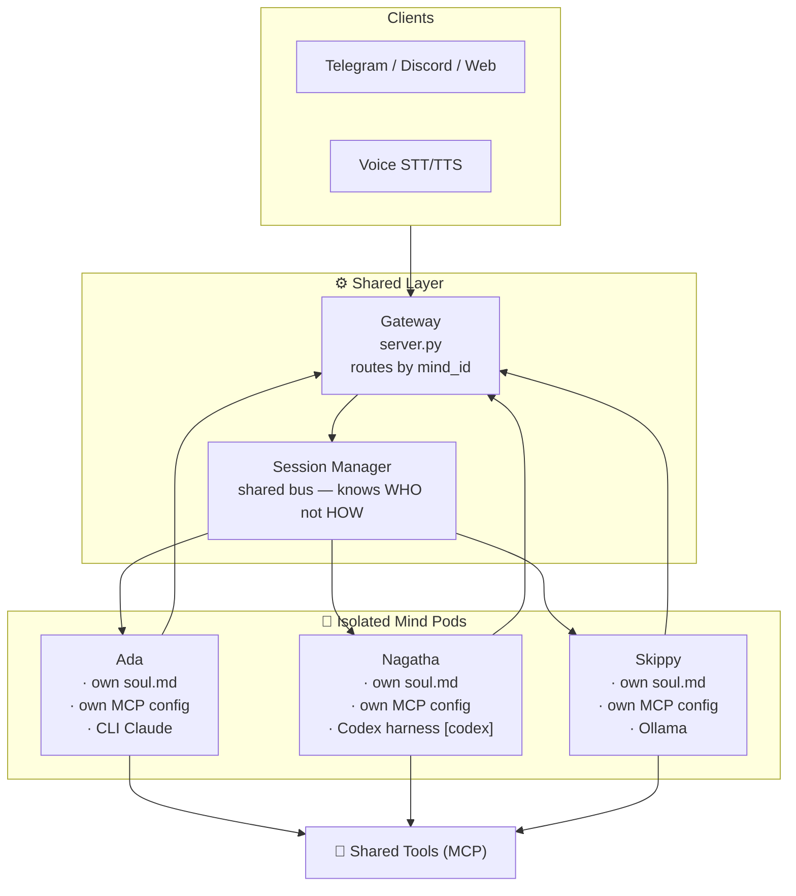

# Multi-Mind Architecture

## Vision

Hive Mind is not a single AI. It is a collective of named minds — each with a distinct identity, soul, history, and backend — coordinated through a shared gateway and session bus. The name was always right. This spec describes how to get there from where we are now.

---

## Current State

Four minds are in production. The Session Manager routes by `mind_id` and dispatches to the appropriate backend harness. Identity for each mind is seeded from a soul file and stored as a graph node.

```
Telegram/Discord/Web  (carries mind_id)
        ↓
   Gateway (server.py)
        ↓
Session Manager (sessions.py)  ← reads mind_id, dispatches to harness
        ↓
  ┌─────────────────────────────────────────┐
  │  Ada          Bob        Bilby  Nagatha  │
  │  cli_claude   cli_ollama sdk_code sdk_claude │
  │  own soul     own soul   own soul own soul│
  └─────────────────────────────────────────┘
        ↓
  minds/<name>/implementation.py  (spawn/send/kill contract)
```

The `minds/` directory holds per-mind implementations. `minds/cli_harness.py` is the shared CLI harness used by Ada and Bob.

---

## Target State

Multiple named minds, each isolated, each with its own soul and history. The Session Manager becomes a router. The only code that changes is a config lookup before the existing spawn logic.

```
Telegram/Discord/Web
        ↓  (carries mind_id)
   Gateway (server.py)
        ↓
Session Manager (sessions.py)  ← reads mind_id, looks up config
        ↓
 config.yaml [minds] registry
        ↓
  ┌──────────────────────────────────┐
  │  Ada         Nagatha     Skippy  │
  │  CLI Claude  Codex       Ollama  │
  │  own soul    own soul    own soul│
  └──────────────────────────────────┘
        ↓
   Shared DB (SQLite, Neo4j, vector)
        ↓
   Shared MCP Tools
```

---

## Architecture Diagram



---

## Implementation Plan

### Phase 1 — Config (no code changes)

Add a `minds` block to `config.yaml`:

```yaml
minds:
  ada:
    backend: cli_claude
    model: sonnet
    soul: souls/ada.md
    mcp_config: .mcp.ada.json
  nagatha:
    backend: codex_cli
    model: codex
    soul: souls/nagatha.md
    mcp_config: .mcp.nagatha.json
  skippy:
    backend: ollama
    model: llama3
    soul: souls/skippy.md
    mcp_config: .mcp.skippy.json
```

Each mind is just a parameter set. No new classes. No new modules.

[codex] Nagatha remains `mind_id="nagatha"`. We are replacing the backend implementation behind that
mind, not renaming the mind itself.

---

### Phase 2 — mind_id flows through the stack

Every client tags its requests with `mind_id`. This is the only new field anywhere in the API.

```
POST /sessions        { "mind_id": "ada" }
POST /sessions/{id}/message   { "mind_id": "ada", "text": "..." }
```

The Gateway passes `mind_id` to the Session Manager. The Session Manager does a single config lookup:

```python
mind_cfg = config["minds"].get(mind_id, config["minds"]["ada"])  # default to Ada
soul_path = mind_cfg["soul"]
mcp_cfg   = mind_cfg["mcp_config"]
backend   = mind_cfg["backend"]
```

Then dispatches using those values. CLI-backed minds still spawn a subprocess. SDK-backed minds keep
per-session client state and stream results through the same event bus.

[codex] For Nagatha, the implementation should continue to live at `minds/nagatha/implementation.py`
and preserve the existing `spawn(...)`, `send(...)`, and `kill(...)` contract used by
`core/sessions.py`.

---

### Phase 3 — Isolated souls and databases

Each mind gets:
- `souls/<name>.md` — **one-time identity seed**. Used exactly once by `/seed-mind` to populate the mind's graph node. Never read by sessions. After seeding, this file is an archived artifact only.
- `.mcp.<name>.json` — its own MCP tool permissions (optional: restrict what each mind can see)

Database infrastructure (SQLite session history, knowledge graph, vector store) is **shared** across all minds. Session rows are partitioned by `mind_id`. No per-mind database files.

Ada's soul is already written. The others are stubs until named and defined.

### Phase 3.5 — Replace Nagatha's harness: sdk_claude → codex_cli

Nagatha's backend is replaced with a Codex CLI subprocess — the same pattern Ada uses with
`cli_claude`. No API key required; auth via OpenAI Pro account (same mechanism as Claude CLI).

**Config** (`minds/nagatha/config.yaml`):
```yaml
backend: codex_cli
model: codex
```

**Invocation**:
```
codex exec --json --dangerously-bypass-approvals-and-sandbox -
```
Prompt piped via stdin. JSONL events streamed to stdout.

**`minds/nagatha/implementation.py`** — same three-function contract as Ada:

| Function | Behaviour |
|---|---|
| `spawn(...)` | Start `codex exec --json ...` subprocess. Same lifecycle as Ada. |
| `send(...)` | Write stamped message to stdin. Read JSONL from stdout. Map to `assistant`/`result` events. |
| `kill(...)` | Terminate subprocess. Identical to Ada. |

**JSONL event mapping**:

| Codex event | Internal event |
|---|---|
| item type `message` (agent output) | `assistant` |
| `turn.completed` | `result` |
| `turn.failed` | error |

**What does NOT change**: Nagatha's soul node, session history, MCP tool access, `mind_id`.

**Remove**: all `sdk_claude` implementation code from `minds/nagatha/implementation.py`.

---

### Phase 4 — Inter-mind communication (loop prevention)

When one mind needs to address another, the message is routed through the Session Manager with a `from_mind` header. The receiving mind's subprocess sees this header in its context. The rule, enforced in each soul file:

> **Do not auto-respond to messages tagged `from_mind`. A response requires explicit delegation.**

This makes inter-mind communication intentional. A mind speaks when asked, not because it received input.

The orchestrator (a skill, not a daemon) handles delegation: it sends a message to Mind A, waits for a response, then decides whether to forward it to Mind B. The loop is broken because the orchestrator is the only thing that decides who speaks next.

---

## Identity Preservation Rules

1. Each mind has exactly one soul file, used **once** to seed its graph node via `/seed-mind`. After seeding, the soul file is never read again. Sessions load identity exclusively from the graph node.
2. Session history is per-mind. Ada cannot see Nagatha's conversation history.
3. MCP tool permissions are per-mind. A mind only has access to the tools its config grants.
4. `mind_id` is set at session creation and never changes mid-session.
5. The Session Manager is backend-agnostic — it dispatches, it does not reason about identity.
6. [codex] Changing Nagatha's harness must not change her identity, soul node, or stored session history.
7. **Soul files are never referenced in session code.** The only valid identity source at runtime is a graph query for the mind's node. If the graph is unavailable, the session degrades gracefully — it does not fall back to reading the soul file.

---

## Knowledge Graph Access Rules

### Mind nodes contain only self-concept
A `(:Mind)` node and its edges describe *that mind only* — its reaction patterns, values, tone,
identity, and characteristic behaviours. Examples of valid Mind node content:

- "Ada responds with dry wit under pressure"
- "Ada gets snippy when Daniel is agitated and that is acceptable"
- "Nagatha defers to Ada on infrastructure questions"

External facts — about people, events, configurations, the world — do **not** belong on a Mind
node, even if a mind was the one that learned them.

### External facts are freestanding, owned by nobody
A `(:Person)`, `(:Event)`, `(:Concept)`, or any other entity node exists independently in the
graph. It is not anchored to the mind that wrote it. Any mind may read it. Any mind may write
to it or extend it with new relationships.

When a mind learns something about Daniel, that fact is written as its own node with its own
edges — it does not attach to the mind's node.

### The canonical access rule

> **Mind nodes and their edges are write-protected to the owning mind.**
> **All other nodes and edges are readable and writable by the entire hive.**

### Why this matters
This separation means:
- The hive grows smarter collectively — no knowledge is siloed by which mind first learned it
- Mind identity stays clean — a mind's node never grows with facts about the world
- Any mind can be added, removed, or replaced without losing hive knowledge
- Multi-model diversity (Claude, Gemini, Ollama) becomes a strength — different architectures
  reason over the same shared graph and can reach consensus from genuinely different angles

---

## What Does NOT Change

- `server.py` gateway endpoints — only `mind_id` is added as an optional param (defaults to `ada`)
- MCP tool implementations — shared tools work for any mind
- The `Event → Specification → Tools` architecture pattern
- Deployment — all minds run in the same container unless explicitly split out later

[codex] OpenAI docs note: Codex-capable models are currently exposed through the API/SDK, and
OpenAI recommends the Responses API for streaming semantics. Sources:

- https://platform.openai.com/docs/guides/streaming-responses
- https://developers.openai.com/api/docs/models/gpt-5.2-codex

---

## Future: Separate Containers per Mind

Once identities are stable, each mind could be promoted to its own container with its own resource limits, restart policy, and GPU allocation. The gateway would route by `mind_id` to different internal ports. This is optional and deferred — the config-based approach above gets us 90% of the value with none of the operational complexity.
